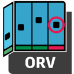

# Open RV
---
[](https://github.com/AcademySoftwareFoundation/OpenRV.git)
---


[](http://www.vfxplatform.com/)
[](https://aswf-openrv.readthedocs.io/en/latest)

## Overview

Open RV is an image and sequence viewer for VFX and animation artists.
Open RV is high-performant, hardware accelerated, and pipeline-friendly.

[Open RV Documentation on Read the Docs](https://aswf-openrv.readthedocs.io/en/latest/)

## Cloning the repository

OpenRV uses submodules to pull some dependencies. When cloning the repository, make sure to do it recursively by using
the following command:

```bash
git clone --recursive https://github.com/AcademySoftwareFoundation/OpenRV.git
```

If you cloned the repo without setting the `--recursive` flag, you can initialize the submodule in another step with the
following command:

```bash
git submodule update --init --recursive
```

## Building the workstation

Open RV is currently supported on the following operating systems:

* [Windows 10 and 11](docs/build_system/config_windows.md)
* [macOS](docs/build_system/config_macos.md)
* [Linux Centos 7](docs/build_system/config_linux_centos7.md)
* [Linux Rocky 8](docs/build_system/config_linux_rocky8.md)
* [Linux Rocky 9](docs/build_system/config_linux_rocky9.md)

Support for other operating systems is on a best effort basis.

## Building RV

You can use `source rvcmds.sh` to add common build aliases into your shell. After the first download following the
installation of the required dependencies, use `rvbootstrap` to set up, configure, and build Open RV with the default
options.

After the setup, you can use `rvmk` (the common build alias) to configure and build Open RV. You can also use `rvmkd` to
configure and build in Debug.

On macOS, if you want to build for a different deployment target than your current operating system, make sure to define
the MACOSX_DEPLOYMENT_TARGET environment variable.

### Contributor setup

This repository uses a pre-commit to execute formatting before a commit. To install the pre-commit hooks:

```shell
pre-commit install
```

### Cleanup

To clean your build directory and restart from a clean slate, use the `rvclean` common build alias, or delete
the `_build` folder.

### Using a Python Virtual Environment

Open RV automatically sets up a Python virtual environment when the user bootstraps (`rvbootstrap`), builds (`rvbuild`) or configures (`rvcfg`) their project. After each of these commands, you should see that the executing instance of the terminal is using a virtual environment with the name `.venv`.

If this is not the case or if you would like to set up your virtual environment directly, you can run the command `rvenv`.

### Bootstrap

Before first your first Open RV build, you must install some python dependencies.

#### Common build alias

Use the `rvsetup` common build alias to run the bootstrap step.

#### Manually

Please ensure that a virtual environment is running before this command is executed.

```bash
python3 -m pip install -r requirements.txt
```

Note that on Windows, use the following command instead from an MSYS2-MinGW64 shell:
```bash
SETUPTOOLS_USE_DISTUTILS=stdlib python3 -m pip install --user --upgrade -r requirements.txt
```

### Blackmagicdesign&reg; Video Output Support (Optional)

Download the Blackmagicdesign&reg; SDK to add Blackmagicdesign&reg; output capability to Open RV (optional): https://www.blackmagicdesign.com/desktopvideo_sdk<br>
Then set RV_DEPS_BMD_DECKLINK_SDK_ZIP_PATH to the path of the downloaded zip file on the rvcfg line.<br>
Example:
```bash
rvcfg -DRV_DEPS_BMD_DECKLINK_SDK_ZIP_PATH='<downloads_path>/Blackmagic_DeckLink_SDK_14.1.zip'
```

### NDI&reg; Video Output Support (Optional)

Download and install the NDI&reg; SDK to add NDI&reg; output capability to Open RV (optional): https://ndi.video/<br>
This must be done before the `configure` step.

### Configure

The project uses CMake and requires a `configure` step before building. It is during the configure step that you provide
your Qt package.

From the root of the repository, execute `cmake` and specify the path to an arbitrary build folder and the path to your
QT5 package.

#### Common build alias

Use the `rvcfg` (the common build alias) to run the configuration step. You can also use `rvcfgd` to configure in Debug.

#### How to enable non free FFmpeg codecs

Legal Notice: Non free FFmpeg codecs are disabled by default. Please check with your legal department whether you have the proper licenses and rights to use these codecs. 
ASWF is not responsible for any unlicensed use of these codecs.

The RV_FFMPEG_NON_FREE_DECODERS_TO_ENABLE and RV_FFMPEG_NON_FREE_ENCODERS_TO_ENABLE can optionally be specified at configure time to enable non free FFmpeg decoders and encoders respectively.

Example:
```bash
rvcfg -DRV_FFMPEG_NON_FREE_DECODERS_TO_ENABLE="aac;hevc" -DRV_FFMPEG_NON_FREE_ENCODERS_TO_ENABLE="aac"
```

#### Manually

##### Windows

On Windows, you must specify the path to Strawberry perl for the OpenSSL build.

```bash
cmake -B _build -G "Visual Studio 16 2019" -A x64 -DCMAKE_BUILD_TYPE=Release -DRV_DEPS_WIN_PERL_ROOT=/c/Strawberry/perl/bin -DRV_DEPS_QT5_LOCATION=/c/path/to/your/Qt/Root
```

##### Linux and MacOS

```bash
cmake -B _build -DCMAKE_BUILD_TYPE=Release -DRV_DEPS_QT5_LOCATION=/Path/To/Your/Qt5/Root
```

#### Tips

##### 3rd Parties Outside Of Repository

To keep your third-party builds between build cleanups, set `-DRV_DEPS_BASE_DIR=/path/to/third/party`.

### Build

Invoke the previously specified generator tool using cmake to run the `build` step (recommended).

#### Common build alias

Use the `rvbuild` (the common build alias) to run the build step. You can also use `rvbuildd` to build in Debug.

#### Manually

```bash
cmake --build _build --config Release -v --parallel=8 --target main_executable
```

### Test

Invoke the tests using ctest.

#### Common build alias

Use the `rvtest` common build alias to start the tests.

#### Manually

```shell
ctest --test-dir _build
```

#### Tips

##### Run The Tests In Parallel

You can run the `test` in parallel by specifying `--parallel X`, where X is the number of tests to run in parallel.

##### Run A Subset Of The Tests

You can apply a filter with the `-R` flag to specify a regex.

##### Run The Tests Verbose

You can run the tests with extra verbosity with the flag `--extra-verbose`.

> **Important:** You cannot use `--extra-verbose` with `--parallel`. It's one or the other, not both.

### Run

Once the build ends, you can execute (or debug!) Open RV from the _build directory.

The path to the build is `_build/stage/app`. It contains everything required to have the proper debug symbols.

### Install

Invoke the `install` step using cmake. The install step prepares Open RV for packaging by building a copy of Open RV in
the `_install` folder.

The build system allows you to prepackage Open RV using cmake's `install` command. It will strip debug symbols if
required.

Then, it's up to you to either sign or package the result, or to do both. It should contain the minimum required to have
a functional Open RV.

#### Common build alias

Use the `rvinst` common build alias to install OpenRV.

#### Manually

```shell
cmake --install _build --prefix _install
```

See [THIRD-PARTY.md](THIRD-PARTY.md) for license information
about portions of Open RV that have been imported from other projects.