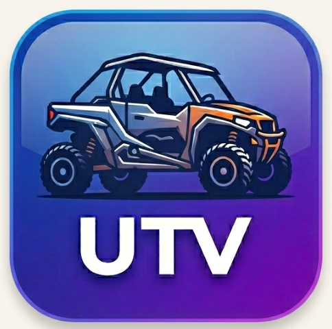

# UTV

---

<p align="center">
  
</p>

<p align="center">
  <a href="https://github.com/makaisystems/utv/releases"></a>
  <a href="https://github.com/makaisystems/utv/actions/workflows/build-and-release-macos.yml"></a>
  
  <a href="https://github.com/makaisystems/utv/stargazers"></a>
</p>

---

## 🎬 A Player for the Masses

UTV is a highly performant, natively installable image and sequence viewer.

While heavily inspired by high-end visual effects software, UTV strips away the massive dependencies and VFX reference platform mandates. It is designed to be a **lightweight, distributable framecycler** that anyone can install and run instantly.

Whether you are a freelance artist, an editor, or just need to smoothly scrub through 4K image sequences, UTV provides a world-class engine without the bloat of an enterprise pipeline.

---

## 🚀 Installation

### macOS (Homebrew)

You can install the pre-compiled native macOS (Apple Silicon) binary directly from our custom Homebrew tap:

```bash
brew install --cask makaisystems/utv/utv
```

*(Support for `apt`, `dnf`, `winget`, and `choco` is coming soon!)*

---

## 🛠️ Building from Source

If you want to build UTV from source or contribute to the project, the process is streamlined.

### 1. Install Dependencies

Using Homebrew on macOS, install the required compilers and libraries:

```bash
brew install ninja readline sqlite3 xz zlib tcl-tk@8 python-tk autoconf automake libtool python@3.14 yasm clang-format black meson nasm pkg-config glew ccache ffmpeg openexr imath opencolorio libraw libtiff libpng boost openimageio openjpeg webp yaml-cpp spdlog icu4c openjph jpeg-turbo
```

*(Note: UTV requires Qt 6.11 or later).*

### 2. Build the Application

Once dependencies are installed, simply run the build script:

```bash
git clone --recursive https://github.com/makaisystems/utv.git
cd utv
./build.sh --release --clean
```

The compiled binary will be placed in `_build/stage/app/UTV.app`.

---

## 🤝 Contributing & Governance

We welcome community contributions! Please read our [CONTRIBUTING.md](CONTRIBUTING.md) and [GOVERNANCE.md](GOVERNANCE.md) to get started.

## 📈 Star History

[](https://star-history.com/#makaisystems/utv&Date)

---

## 📜 About Third-Party Licenses

See [THIRD-PARTY.md](THIRD-PARTY.md) for license information about portions of UTV that have been imported from other projects.
