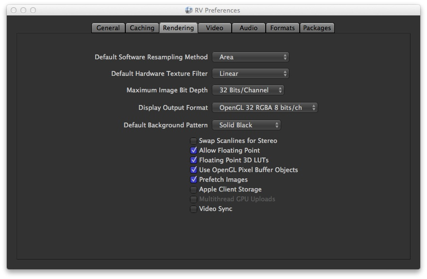
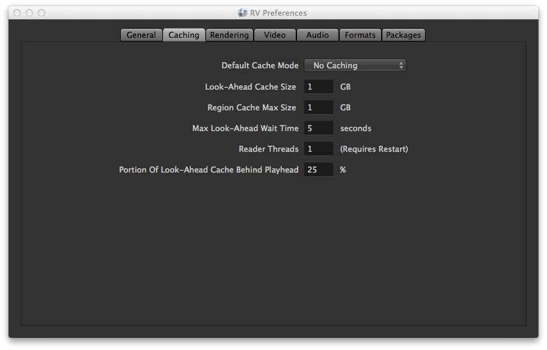

# Chapter 14 - Maximizing Performance

RV is primarily a desktop playback program. As such, there are no guarantees about performance. That being said, there are a number of methods to tune performance for any particular hardware configuration and operating system. The most important parameters to tune for good performance in RV are:

*   The number of CPUs/cores available versus the number of reader threads used in RV
*   The specific file format being read (not all are created equal) and possible filesystem requirements like striping or guaranteed bandwidth constraints
*   The I/O method for each file format (if it has multiple methods) versus the type of mass storage (SAN, RAID, or stripped disks, etc)
*   If the file format decoder is threaded, the number of threads used for decoding (and balancing that with the number of reader threads)
*   A fast PCI bus and a recent GPU

Most of these settings are available from either the caching preference pane or the rendering preference pane.

  

Figure 14.1: Render Preference Pane

  

Figure 14.2: Caching Preference Pane

### 14.1 File I/O and Decoding Latency


When reading frames directly from disk, file I/O is often a huge bottleneck. If your frames live across a network connection (such as an NFS mount) the latency can be even greater. Ideally, if RV is playing frames without caching, those frames would be on a local disk drive, RAID, or SAN sitting on a fast bus.

Part of the I/O process is decoding compressed image formats. If the decoding is compute intensive, the time spent decoding may become a bottleneck. If good playback performance off of disk is a requirement, you should choose a format that does not require extensive decoding (Cineon or DPX) or one that can be parallelized (EXR).

As always, there is a tradeoff between file size and decoding time. If you have a very slow network, you might get better performance by using a format with complex expensive compression. If your computer is connected to a local high-speed RAID array or an SSD, then storing files that are easy to decompress but have larger file size may be better.

#### 14.1.1 EXR, DPX, JPEG, Cineon, TARGA, and Tiff I/O Methods

The OpenEXR, DPX, JPEG, Cineon, TARGA, and Tiff file readers all allow you to choose between a few different I/O methods. The best method to use depends on the context RV is being used in. The method can be selected either from the command line or from the preferences (under each of the file formats). The command line options -exrIOMethod, -dpxIOMethod, -jpegIOMethod, -cinIOMethod, -tgaIOMethod, and -tiffIOMethod, require a number which corresponds to the methods listed in Table [14.1](#io-methods) and an optional I/O chunk size in bytes. Currently only the asynchronous methods use the chunk size.

| Method                  | Number | Description                                                                                                                                                                    |
| ----------------------- | ------ | ------------------------------------------------------------------------------------------------------------------------------------------------------------------------------ |
| Standard                | 0      | Use the standard native I/O method on the platform. On Windows this uses the WIN32 API. On Linux/Mac the standard C++ I/O streams are used. The file may be decoded piecemeal. |
| Buffered                | 1      | Use the standard I/O but prefer that the file system cache is used. Attempt to read the file in the largest chunk possible.                                                    |
| Unbuffered              | 2      | Use the standard I/O but ask the kernel to bypass the file system cache. Attempt to read the file in the largest chunk possible.                                               |
| Memory Mapped           | 3      | Memory Map files using the native memory mapping API.                                                                                                                          |
| Asynchronous Buffered   | 4      | Asynchronous I/O using the native API. The chunk size may need to be manually tuned.                                                                                           |
| Asynchronous Unbuffered | 5      | Asynchronous I/O using the native API and bypassing the file system cache. The chunk size may need to be manually tuned.|

Table 14.1: I/O Methods <a id="io-methods"></a>

On Windows, the default is to use the Asynchronous Unbuffered method; this method generally produces the best results over the network and acceptable performance from a local drive.

Typically, the circumstance in which RV is used will dictate which method is optimal.

When using multiple reader threads, asynchronous methods may not scale as well as the synchronous ones.

#### 14.1.2 Multiple Reader Threads

When caching to the region or look-ahead cache, multiple threads can be used to read and process the frames. This can have a profound impact on I/O speed for most formats. You can select the number of threads from the command line using -rthreads or via the preferences under Preferences → Caching (requires restarting RV to take effect).

The optimal number of threads to use varies with file format, hardware, and network or storage. However a good rule of thumb is to use the number of cores minus one; this leaves one core to handle I/O overhead and other threads (like audio) which may need to run as well. In some cases using more threads may increase performance and in others it will decrease performance.

The file format used can also have an impact on the number of threads. OpenEXR in particular has its own threaded decoder. It may be necessary to leave some cores free to decode only.

With Quicktime movies, the codec becomes important when using multiple threads. For single frame codecs like Photo-JPEG using many threads is advantageous. For H.264 and similar inter-frame codecs, using a single thread is usually the best bet though internally the writer may create more threads.

If your storage hardware has high latency (for instance network storage vs local disk) you may find that it makes sense to have more reader threads than cores. This is because the high latency means that most reader threads will sit in IO wait states and not compete for CPU cycles. In general, in network storage situations, it makes sense to start with a number of reader threads equal to cores-1 or cores-2 and then increase the number of reader threads until you see a drop in performance. Also note that it is difficult to test this kind of performance, since a modern operating system will cache pages read from the network or disk in a RAM filesystem cache. On Linux, you can clear the page cache by typing:

```
shell> echo 1 > /proc/sys/vm/drop_caches
```

As root.

### 14.2 Internal Software Operations


Some operations occur in software in RV. For example, when you read images in at a reduced resolution, the image has to be resampled in software. When software operations are being performed on incoming images, it's a good idea to use caching. If direct from disk playback performance is important than these operations should be avoided:

*   Image resolution changes
*   Pre-Cache LUT
*   Color resolution changes (e.g. float to 8 bit int color)
*   Cropping
*   Channel remapping

The use of cropping can either increase or decrease performance depending on the circumstances.

### 14.3 RAM

The fastest playback occurs when frames are cached in your computer's RAM. The more RAM you have, the more frames that RV can cache and the more interactive it becomes. By default RV will load images at their full bit depth and size. E.g. a 32 bit RGBA tiff will be loaded, cached and sent to the graphic card at full resolution and bit depth. This gives artists the ability to inspect images with access to the full range of color information and dynamic range they contain, and makes it possible to work with high-dynamic range imagery.

However, for playback and review of sequences at speed users may wish to cache images with different settings so as to fit more frames into the available RAM. You increase the number of frames that will fit in the cache by having RV read the frames with reduced resolution. For example, reducing resolution by half can result in as many as four times the number of frames being cached.

Similarly, reducing the color resolution can squeeze more frames into memory. For example a 1024x1024 4 channel 8-bit integer image requires 4Mb of memory internally while the same image as 16-bit floating point requires 8Mb and a 32-bit float image requires 16Mb. So by having RV reduce a 32-bit float image to an 8-bit image, you can pack four times the number of frames into memory without changing the image size.

Not caching the Alpha channel of a 4 channel image will also reduce the memory footprint of the frames. You can tell RV to remap the image channels to R, G, B before caching (See [7.3.2](rv-user-manual-chapter-seven.md#732-channel-remapping) ). This may affect playback speed for other reasons, depending on your graphics card. You will need to experiment to determine if this works well on your system.

#### 14.3.1 Pixel Buffer Objects (PBOs) and Prefetch

RV has an optional method of uploading pixels to the graphics card (PBOs). Normally, this is the fast path for maximum bandwidth to the card. However, some combinations of driver and GPU may result in poor performance. You can turn off the use of PBOs in the preferences or from the command line if you suspect PBOs are causing a bottleneck.

Prefetch is only useful in conjunction with PBOs. Prefetch will attempt to asynchronously upload upcoming frames to the card ahead of the display frame. This option can add another 20% to display performance in some cases and cause a negative impact in others.

If you're using a particular image format frequently it's a good idea to test using PBOs and prefetch to see how they perform on your hardware. To do so: cache a number of frames using the region cache. Make sure realtime mode is NOT on (in other words use play-all-frames mode). Set the target FPS to something impossible like 500 fps. With the preferences render pane open try playing back the frames from cache and see how fast it can go. Turn on and off PBO and prefetch usage to see what happens.

#### 14.4.1 24 FPS 2048x1556 10 Bit DPX From Disk

To achieve 24 fps DPX playback from disk at least a two core CPU with a RAID or other device which can achieve minimum sustained bandwidth of 300+Mb/sec across the whole array and sufficient latency and I/O transactions per second. Using two or more reader threads (depending on the number of available cores) with the look-ahead cache on can result in 24 fps DPX playback. This configuration should be purely bandwidth limited meaning that more bandwidth would result in higher FPS.

Not all configurations will work. You may need to experiment.

#### 14.4.2 OpenEXR 24 FPS 2048x1556 3 Y-RY-BY 16 bit Floating Point B44 and B44A From Disk

OpenEXR decoding benefits from more cores. For best results a 4 or 8 core machine is required. B44 2k full-aperture 4:2:0 sampled files are approximately 4Mb in size so they don't require as much bandwidth as DPX files of the same resolution. For 4:4:4 sampled or B44A with an alpha channel more bandwidth and cores may be required. Generally speaking you should have about as much bandwidth as similar DPX playback would require.

When decoding EXR files, you have the option of setting both the number of reader threads in RV and the number of decoder threads used by the EXR libraries. The exact numbers depend on the flavor of B44/A files being decoded.

#### 14.4.3 Individual Desktop Review

For individual desktop review the best quality and economy is undoubtably the use of QuickTime movies encoded with the Photo-JPEG codec. RV can play these back and create them on all three platforms. The image quality is good and the interactivity with the file is excellent (unlike H.264 which is slower when accessed randomly). If large QuickTime files are needed, RV can use multiple threads to decode the QuickTime movies efficiently. Many workstations can handle playback of 2k and 1080p Photo-JPEG QuickTime movies from the desktop using RV.

## 14.5 Optimizing Open RV Playback Performance

RV has a number of features intended to make it possible to read 2k or greater directly from fast I/O devices. Because there are more than a few variables that determine I/O and decoding speed you should try to start with a simple set of parameters in RV and then adjust one at a time. If you adjust all of them at the same time it’s much harder to figure out a sweet spot.

We will try and update this with more information when we can.

### 14.5.1 Quick Start


RV is most often used on the artist desktop, so the default preferences are not configured for streaming I/O. The most important changes to make to enable streaming I/O are listed here. More detail and other options are described below:

1.  Turn on the **Lookahead Cache**
2.  Increase the number of **Reader Threads** in the RV preferences (experiment to find the best number)
3.  If necessary, try **alternate I/O Methods** in the per-format image preferences
4.  Use **prefetch** (with or without PBOs on) found in the Preferences-&gt;Render section
5.  On linux try running RV as root with **-scheduler SCHED_RR -priorities 99 99** (see below) to make playback soft real-time

### 14.5.2 System Requirements


We don't have a fixed system which we can recommend. People have been using a variety of different setups to get streaming play back. However you will definitely benefit if you have:

*   Lots of cores + procs
*   Lots of memory (6 Gb on a 64 bit machine is a good idea)
*   64 bit machine
*   A recent GPU (doesn't always have to be a Quadro)
*   A good motherboard
*   Some kind of fast I/O device. e.g a RAID, ioXTREME, etc. (A single "fast" disk drive probably won't cut it)
*   NVidia card. Cheapo 580 Quadro is pretty good, Newer is probably better. Newer Geforce cards are probably good too.

**Streaming I/O Image Formats**

Streaming will only work with these formats. If you manage to get it to work with something other than one of these you are a miracle worker.

*   DPX and Cineon -- especially 10 bit files
*   JPEG
*   TARGA (TGA)
*   TIFF -- typically RAW tiff works best, no compression
*   EXR or ACES

### 14.5.3 Multiple Reader Threads

It is necessary to use multiple reader threads to get any kind of fast I/O streaming. In order to do so you *must be using the Look-Ahead cache* . We recommend using the smallest possible value for the look ahead cache size. Some people have said that more than 1Gb (and sometimes A LOT more) works for them. Ideally this number is not more than 1Gb.

If you don't have at least two cores available you will probably not get streaming play back .

**Start with two threads** . Optimize for speed with two threads and the try increasing the number after that. The number of threads can be controlled from the preferences under the caching tab. You need to restart RV when you change the number of threads.

The more cores and procs you have the better. The more memory you have the better.

### 14.5.4 Multiple EXR decoding threads

If you want to stream EXR files you may want to reserve some of your cores for decoding. The number of EXR decoding threads can be changed from the preferences under the formats tab. Try "automatic" first.

### 14.5.5 I/O Methods

Which I/O method to use is hard to determine without experimenting. You can change the I/O method from the preferences formats tab. The basic I/O methods are:

*   **Standard** (for some formats). This uses whatever is considered the standard or normal way to read these files. For example with EXR this uses the "normal" EXR I/O streams that come as part of the EXR libraries.
*   **Buffered** . The data is "streamed" as a single logical read of all data. The file data is allowed to reside in the filesystem cache if the kernel decides to do so. The file data is decoded after all the data is read.
*   **Unbuffered** . Similar to buffered except that RV provides a hint to the kernel that file data should not be put into the filesystem cache. In theory this could lead to faster I/O because a copy of the data is not created during reading. In practice we've never seen this really help. There's a lot of debate on the internet about whether Unbuffered I/O is useful or not.
*   **Memory Mapped** . The file contents are mapped directly to main memory. This has the advantage that it may not be filesystem cached and the memory is easily reclaimed by the process when no longer needed. In some respects it is similar to the buffered method above. On windows this method can increase the speed of local I/O significantly compared to the buffered, unbuffered, and standard methods above.
*   **Asynchronous Buffered** . Similar to buffered above, however, the kernel may provide the data to RV in some random order instead of waiting to assemble the data in order itself. In addition the low-level I/O chunk size can be used to tune the I/O to maximize bandwidth. This method is most useful on Windows. On Linux and Mac Async I/O is not as useful in the context of RV because RV manages decode and read concurrency itself.
*   **Asynchronous Unbuffered** . Same as Asynchronous buffered, but a hint is provided to the kernel to omit storing the data in the filesystem cache if possible. This is the default method on Windows.

### 14.5.6 Rules of Thumb

*   Use the **Prefetch** option in the preferences. This will double the amount of VRAM required, but can significantly increase the amount of bandwidth between RV and the graphics card. This can be especially important when viewing stereo. Ideally, **Pixel Buffer Objects (PBOs)** are also turned on. Modern graphics cards benefit from turning on PBOs. For older cards you should experiment with them on and off -- even some pre-fermi Quadro cards can get worse performance with them on.
*   With NVIDIA quadro fermi and kepler GPUs (fermi 4000, 6000, kepler 4000, 5000, 6000) enable **Multithreaded GPU Uploads** for linux and windows. On Mac enable **Apple Client Storage.**
*   On Windows: try **Asynchronous Unbuffered** first. The only other method which might produce good results is **Memory Mapped** .
*   If you are on linux **memory mapping** may cause erratic play back (esp. with software RAID). **Unbuffered** or **buffered** , are the preferred methods. However, if it works for you, great.
*   The **Unbuffered** method may be a placebo on linux. It appears to depend on the type of filesystem you are reading from. For example on ubuntu 10.04 with ext4 it seems to be identical to **buffered** . It may actually be counterproductive over NFS.
*   For EXR *don't* use the **standard** method. **Unbuffered** is typically the best method if the file system supports it.
*   EXR B44 images are ideally subsampled as 4:2:0. Also, keep in mind that B44/A must be 16 bit. PIZ, ZIP, and ZIPS encoded EXR are CPU intensive and may require more EXR decoder threads.
*   If you have recent graphics card try setting the DPX and Cineon 10 bit display depth to **10 Bits/Pixel Reversed** in the format preferences. This is the fastest and most color preserving method of dealing with 10 bit data in RV. If you have a "30 bit" capable monitor like an HP dreamcolor you can additionally put the X server or Windows in 30 bit mode to get both high precision color and fast streaming this way.
*   Displaying 10 bit DPX in 16 bit mode requires 2x the bandwidth from the I/O device AND to the graphics card that 8 bit mode does. If you can use the 10 bit mode for DPX/Cineon try 8 bit first.
*   If you I/O device has big latency, you may need to increase the number of reader threads dramatically to amortize the delay. It some cases it may be beneficial to use more threads than you have cores. This can happen with network storage.
*   Make sure RV's v-sync is not on at the same time that the driver's GL v-sync is on.
*   DPX files which are written so that pixel data starts 4096 bytes into the file, are little-endian, and which use four channel 8 bit, 3 channel 10 bit, or 4 channel 16 bit, and which have a resolution width divisible by 8.
*   For all speed tests, be sure you're in "Play All Frames" mode (Control men) as opposed to "Realtime". In this context, "Realtime" means RV will skip video frames in order to keep pace with the audio.
*   Not all I/O methods are supported by all file systems. In particular, the **Unbuffered** I/O method may not be supported by the underly file system implementation.

### 14.5.7 A Note on Testing and the Filesystem Cache

All operating systems (that RV runs on) try to maximze IO throughput by holding some pages from the filesystem in memory. The algorithms can be quite hard to predict, but the upshot is that if you're trying to test realtime streaming IO performance this "assistance" from the OS can invalidate your numbers; to be clear, for testing, you want to ensure that you start each run with **none** of the sequence to be played in memory. One way to do this is with a very large test set. Say several sequences, each of several thousand frames. If the frames are big enough and you RAM is small enough, then swiching to new sequence for each testing run will ensure that no part of the new sequence is already in the filesystem cache.

But a more certain way to ensure that none of your frames are in the memory, which also lets you use the same sequence over and over for testing, is to forcibly clear the filesystem cache before each testing run. On Linux you can run this command:

```
 sudo echo 1 > /proc/sys/vm/drop_caches
```

On macOS, you can:

```
 purge
```

### 14.5.8 Real-Time

On Linux, you can tell RV to run as a real-time application. This mode enables the most stable possible playback on linux, especially if the machine as been set up with server time slice durations (which is often the case when the machine is tuned for maximum throughput). Ideally, RV runs with **more and smaller** time slices -- at least for display and audio threads.

To start RV in this mode use:

```
rv -scheduler SCHED_RR -priorities 99 99
```

RV linux will try and use either the FIFO or Round Robin scheduler in place of the normal linux scheduler in this case. In order to do so, it must have the capability CAP_SYS_NICE. This can be achieved in a number of ways, but currently we have only been able to make two of them work: running setuid root on the linux binary so it has root privileges or just running rv as root. Ideally, you can use setcap to mark the rv.bin binary on the filesystem so that it has only CAP_SYS_NICE so non-root users can run it real-time, but we have not been able to get this to work (probably because we don't really understand it yet).

On the Mac, RV is a real-time app by default and does not require any special privileges.

On Windows, RV elevates its priorities as high as possible without admin privileges.

NOTE: When RV runs with higher priorities, this is referring to only two of its threads: the display thread and the audio thread. Neither of these threads do much computational work. They are both usually blocked. So you shouldn't need to worry about RV consuming too many kernel resources.

### 14.5.9 Refresh Rate and V-Sync


The biggest hurdle to making playback absolutely smooth is to recognize the effects of playback FPS coupled with the monitor refresh rate. For example, it’s typically the case that an LCD monitor will have a refresh rate of ~60Hz by default (i.e. it refreshes 60 times a second). Playing 24 FPS material on a 60Hz monitor will result in something similar to a 3/2 pull down. In order to get smoothest playback the ideal refresh rate would be 48 or 72Hz or some other multiple of 24. Also, be aware that a "60Hz" monitor may actually be 59.88Hz which means that even 30 FPS material will not play back perfectly smoothly. You need 59.88 / 2 (29.94) FPS for best results.

#### 14.5.9.1 Multi-monitor Systems

Systems with multiple attached monitors have another problem: the monitor that RV is playing on may not be the monitor that it’s syncing to. If that happens the play back can become very irregular. On linux for example, the driver can only sync to one monitor -- it can't change the sync monitor once RV has started. On linux you can change which monitor the driver uses for sync by setting the environment variable **__GL_SYNC_DISPLAY_DEVICE.** Here's a relevant passage from nvidia's driver README:

> When using __GL_SYNC_TO_VBLANK with TwinView, OpenGL can only sync to oneof the display devices; this may cause tearing corruption on the displaydevice to which OpenGL is not syncing. You can use the environment variable __GL_SYNC_DISPLAY_DEVICE to specify to which display device OpenGL shouldsync. You should set this environment variable to the name of a displaydevice; for example "CRT-1". Look for the line "Connected displaydevice(s):" in your X log file for a list of the display devices presentand their names. You may also find it useful to review [Chapter 10, *Configuring TwinView*](http://ru.download.nvidia.com/freebsd/180.44/README/chapter-10.html) "Configuring Twinview," and the section on Ensuring Identical Mode Timings in [Chapter 16, *Programming Modes*](http://ru.download.nvidia.com/freebsd/180.44/README/chapter-16.html) .

#### 14.5.9.2 RV's V-Sync versus driver V-Sync

When playing 24 frames/second (24Hz) media on a monitor with a refresh rate of 60Hz (60 frames per second) you can only emulate the timing of frames being played on a 24Hz movie projector. It’s not possible to literally get the same timing. The reason is simple math: you can’t evenly divide 60 by 24.

RV tries to get around this issue by playing back at as close to the device rate as possible (in this case 60Hz) and by trying to spread out 24 frames over the 60 actual frames in a visually pleasing way. If you were to look at the timing of the frames you would see that some frames are played back 3 times in a row and others only 2.

The only way around this problem is to match the output device rate to the media rate in such a way that the device rate is evenly divisible by the media rate.

Do not run RV with both the driver's GL v-sync on and RV's. This will almost guarantee bad playback. Use one or the other. You may want to experiment to see if one results in better timing than the other on your system. You can find these settings as follows

*   In RV Preferences under the Rendering tab, there is a "Video Sync" checkbox.
*   In the Nvidia-settings GUI there is an openGL 'Sync to VBlank' checkbox.

Nvidia recommends using the driver v-sync and disabling RV's v-sync if possible. On Linux, RV tries to detect which monitor the driver is using for sync and warn you if it’s not the one RV is playing on (it outputs an INFO message in the shell or console window). In presentation mode, RV shows a message box if the presentation device is not the sync device on linux.
