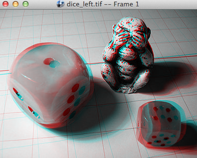
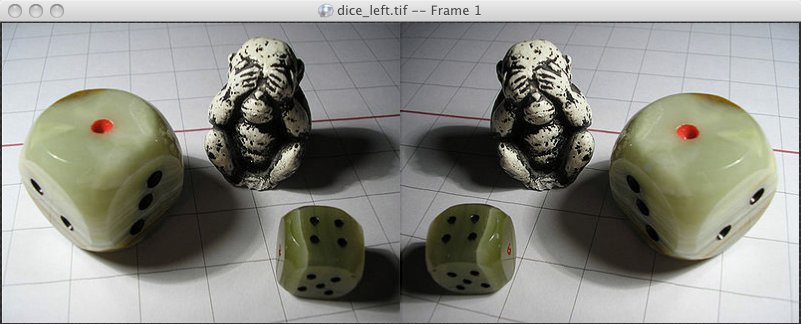
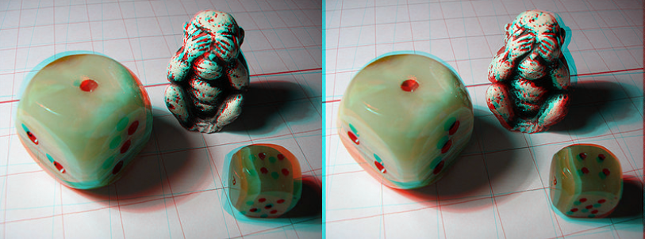
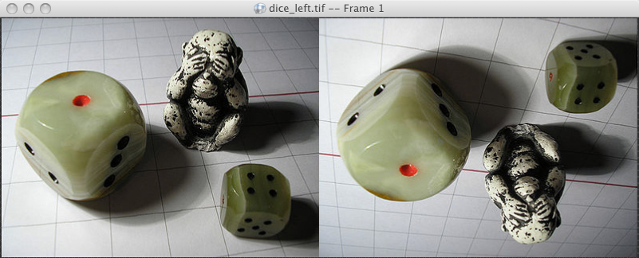

# Chapter 12 - Stereo Viewing

RV can display the first two image layers as stereo. There are several options:

*   Anaglyph
*   Side-by-Side
*   Mirrored Side-by-Side
*   DLP Checker
*   Scanline Interleaved
*   Left or Right eye only
*   Hardware Left and Right Buffers

The stereo rendering is designed to work with the other features of RV. In most cases, color corrections, image geometry manipulations, and display corrections will work in conjunctions with stereo viewing.

When caching is on, all layers are cached (left and right eyes). You will need to reduce the image resolution to cache as many frames as non-stereo.

The left and right eye images are normalized (i.e. conformed to fit the RV window) so they may have different resolutions and/or bit depths. However, it is not advisable to have differing aspect ratios.

You can create stereo sources and set individual stereo parameters from the command line. See Section [3.2.2](rv-user-manual-chapter-three.md#322-dual-image-sequences-andor-movie-files-as-stereo) to see how to do this.

### 12.1 Anaglyph or Luminance Anaglyph

The anaglyph modes display the left eye in the red channel and the right in eye in the green and blue channels (as cyan). If you were to wear colored red-cyan glasses and the eyes are correctly arranged, you should be able to see stereo with pseudo-color. Color anaglyph images work best for outdoor scenes (with lots of green) and in similar cases. They work very poorly with blue or green screen photography. For grey scale/non-color rendition of anaglyph, select the “Luminance Anaglyph” mode (Figure [12.4](#luminance-anaglyph-display) )..

For color anaglyphs, if the color contrast is too great, the stereo effect will be difficult to see. If you turn on luminance viewing (hit the "l" key in the user interface), you can improve the effect (Figure [12.2](#anaglyph-stereo-with-luminance-display) ). A similar solution is to desaturate the image slightly (hit shift "S" and scrub); this will reduce the color contrast but keep some hints of color (Figure [12.3](#anaglyph-display-with-desaturation) ).

Compression artifacts can seriously degrade stereo viewing especially in anaglyph mode. QuickTime movies, for example, with low quality compression may look fine when viewed one eye at a time, but in anaglyph mode JPEG or similar artifacts will be greatly amplified by slight color differences. The best way to view compressed material is with luminance display turned on (no color).

  

Figure 12.1: Anaglyph Stereo Display

  

Figure 12.2: Anaglyph Stereo With Luminance Display 

  

Figure 12.3: Anaglyph Display With Desaturation 

Figure 12.4: Luminance Anaglyph Display 

### 12.2 Side-by-Side and Mirror

Side-by-Side mode displays the left and right eyes next to each other horizontally in full color. Some people are comfortable crossing their eyes to see stereo using this mode.

Mirror mode is similar, but the right eye is flopped. If you need the left eye flopped, turn on mirror mode and select Image->Flop or hit shift-"X" this will have the effect of mirroring the left eye instead. Note that the same effect can be produced by flopping the right eye only in mirror mode.

  

Figure 12.5:

Side-by-Side Stereo Display

  

Figure 12.6:

Mirror Display Mode

### 12.3 DLP Checker and Scanline

These modes are designed to work with DLP projectors or LCD displays that directly support stereo display. In particular RV supports the SpectronIQ HD LCD display and DLP projectors using the Texas Instrument's checkerboard 3D DLP input.

  

Figure 12.7:

DLP (left) and LCD Scanline (right) Stereo Display

### 12.4 HDMI 1.4a 

HDMI 1.4a stereo modes like Side-by-Side and Top-and-Bottom are supported via RV's Presentation Mode, described in Chapter [6](rv-user-manual-chapter-six.md#6-presentation-mode-and-video-devices) . To select one of these modes for your Presentation Device, you choose the appropriate Output Data Format in the Video preferences.

### 12.5 Hardware Stereo Support

RV can render into left and right buffers if your graphics card supports hardware stereo. You can tell if this is the case by seeing if the menu item View → Stereo → Hardware can be selected. If so, RV should be able to create left and right buffers. There are a number of different ways to view stereo with a standard graphics card. See Chapter [B](rv-user-manual-chapter-b.md#b-stereo-setup) for information about how to setup each platform and what options are available at the hardware level.

Typically, hardware support requires shutter glasses (monitor or projection) or polarized glasses (projection only) in order to be useful.

### 12.6 Additional Stereo Operations

These options can be applied per-source as well as part of the global viewing stereo options. The per-source options can be found under the Image → Stereo menu and the global view options are under View → Stereo.

#### 12.6.1 Swap eyes

Swap eyes changes the order of the left and right eyes (left becomes right and vice versa). If you are looking at stereo pairs and you just cannot see the stereo, you may want to try swapping the eyes. It is difficult to view stereo when the eyes are inverted.

#### 12.6.2 Relative Eye Offset

Relative eye offset controls how separated the left and right images are horizontally. In the case of the anaglyph and hardware left and right buffer modes the offset value determines the fusion depth. Objects at the fusion depth appear coincident with the screen depth. In other words, they appear to be right on the screen: not behind it or in front of it. This is most evident in the anaglyph mode where the red and cyan components of a shape will not be separated if it's at the fusion depth. The units of the offset numbers are a percentage of the image width.

You have a choice to either offset the eye images away from each other (both at the same time) or to offset the right eye only.

  

Figure 12.8:

Changing stereo relative eye offset. The left is the original image viewed in anaglyph mode. The right has an additional offset applied.

#### 12.6.3 Flip/Flop the Right Eye Only

If you are projecting stereo and require one eye be flipped (vertical) or flopped (horizontal), you can select Image → Stereo → Flip Right Eye or Image → Stereo → Flop Right Eye. This can further be combined with Image → Flip and Image → Flop and rotation to move the images into the correct position.

  

Figure 12.9:

Flipping One Eye