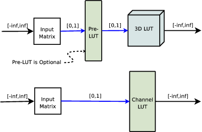

# Using LUTs in Open RV

Look up tables (LUTs) are useful for approximating complicated color transforms, especially those which have no known precise mathematical representation. RV provides four points in its color pipeline where LUTs can be applied: just after reading the file and before caching directly after the cache (file LUT), just before display transforms (look LUT), and as one of the display transforms (display LUT). The first three are per-source while there is only a single display LUT for each RV session.

Each of the LUTs can be either a channel LUT or a 3D LUT (the difference is explained below. In the case of a 3D LUT there can also be an additional channel pre-LUT which can be used to shape the data. Both types of LUT are preceded by an input matrix which can scale high dynamic range data into the range of the LUT input (which is the range [0,1]). The values the LUT produces can be outside of the [0,1] range. This makes it possible for any of the LUTs to transform colors outside of the typical [0,1] range on both input and output.

Internally, RV will store the LUT as either half precision floating point or 16 bit integral. Not all hardware is capable of processing LUTs stored as floating point (esp. the 3D LUTs) so if you notice banding or noisy output when using floating point LUT storage, you may have better luck with the 16 bit integral representation. If RV can determine whether the floating point LUTs are usable itself it will default to whatever is appropriate.

When applied in hardware, the LUTs are interpolated when a value is not exactly represented in the LUT. This is usually more of an issue with 3D LUTs than channel LUTs since they have fewer samples per dimension. When interpolating between sample values, RV uses linear interpolation for channel LUTs and tri-linear interpolation for 3D LUTs.

There are a number of ways to create a LUT. For film look simulation, it’s often necessary to have special hardware to measure and compare film recorder output. Alternately, you use a lightbox; and assuming you have a well calibrated neutral monitor, “eyeball” the LUT by comparing the film to the monitor.

RV has two different algorithms for applying the LUTs on the GPU: using floating point or fixed-point integer textures. Not all cards are equally capable with 3D LUTs and floating point. If RV detects that the card probably can’t do a good job with the floating point hardware it will switch to a fixed-point representation using 16 bit integer LUTs. Sometimes even though the driver reports that the LUTs can be floating point, you will see banding in the final images. If that occurs, try forcing the use fixed-point LUTs by turning off the Floating Point 3D LUTs item on the Rendering tab of the preferences. The fixed point LUT algorithm will perform just as well as floating point in 99% of normal use cases.

## Channel (1D) versus 3D LUTs

A channel LUT (also called a 1D LUT) has three independent look-up tables: one each for the R G and B channels. The alpha channel is not affected by the channel LUT. Channel LUTs may be very high resolution with up to 4096 samples. Each entry in the channel LUT maps an input channel value to an output channel value. The input values are in the [0,1] range, but the output values are unbounded.

Channel LUTs differ from 3D LUTs in one critical way: they can only modify channel values independently of one another. In other words, e.g., the output value of the red channel can only be a result of the incoming red value. In a 3D LUT, this is not the case: the output value of the red channel can be dependent on any or all of the input red, green, and blue values. This is sometimes called channel cross-talk.

The other important difference between channel and 3D LUTs is the number of samples. Channel LUTs are one dimensional and therefor consume much less memory than 3D LUTs. Because of this, channel LUTs can have more samples per-channel than 3D LUTs.

The implication of all this is that channel LUTs are useful for representing functions like gamma or log to linear which don’t involve cross-talk between channels whereas 3D LUTs are good for representing more general color transforms and 

3D LUTs can be very memory intensive. A 64 × 64 × 64 LUT requires 64 <sup>3 </sup> × 4 bytes of data (3Mb). You can quickly run out of memory for your image on the graphics card by making the 3D LUT too big (e.g. 128 × 128 × 128, this will slow RV down). RV does not require the 3D LUT to have the same resolution in each dimension. You may find that a particular LUT is smooth or nearly linear in one or more dimensions. In that case you can use a lower resolution in those dimensions.

Some graphics cards have resolution issues with 3D textures which can cause loss of precision when RV’s 3D LUT feature is enabled. On older NVidia cards and ATI cards in general, 3D textures may be limited to non-floating point color representations. Precision loss when using a LUT can be exacerbated by applying display gamma on these cards. To minimize precision loss on those types of cards, bake monitor gamma and/log-lin conversion directly into the display LUT. With newer GPUs this is not as much of an issue.

## Input Matrix and Pre-LUT

For HDR applications, the incoming data needs to be rescaled and possibly shaped. RV has two separate components which do this: the LUT input matrix and a channel pre-LUT. The input matrix is a general 4 × 4 matrix. For HDR pixels, the matrix is used to scale the incoming pixel to range [0, 1]. The pre-LUT, the channel LUT, and the 3D LUT all take inputs in that range. The figure below shows a diagram of the channel and 3D LUT components and their input and output ranges.

The pre-LUT is identical to the channel LUT in implementation. It maps single channel values to new values. Unlike the general channel LUT, the pre-LUT must always map values in the [0, 1] range into the same range. The purpose of the pre-LUT is to condition the data before it’s transformed by the 3D LUT.

For example, it may make sense for 3D LUT input values to be in a non-linear space – like log space. If the incoming pixels are linear they need to be transformed to log before the 3D LUT is applied. By using a relatively high resolution pre-LUT the data can be transformed into that space without precision loss.



*3D and Channel LUT Components*

## The Pre-Cache LUT

The first LUT that the pixels can be transformed by is the pre-cache LUT. This LUT has the same parameters and features as the other LUTs, but it is applied before the cache. The pre-cache LUT is currently applied by the CPU (not on the GPU) whereas the file, look, and display LUTs are all used by the graphics hardware directly. For this reason the pre-cache LUT is slightly slower than the others.

The pre-cache LUT is useful when a special caching format is desired. For example by using the pre-cache LUT and the color bit depth formatting, you can have RV convert linear OpenEXR data into 8 bit integer format in log space. By using RV’s log to linear conversion on the cached 8 bit data you can effectively store high dynamic range data (albeit limited range) and get double the number of frames into the cache. Many encoding schemes are possible by coupling a custom pre-cache LUT, change of bit depth, and the hardware file LUT to decode on the card.

## LUT File Formats

| Extension | Type | 1D | 3D | PreLUT | Float | Input | Output |
| --- | --- | --- | --- | --- | --- | --- | --- |
| csp | Rising Sun Research | • | • | • | • | [ - ∞ , ∞] | [ - ∞ , ∞] |
| rv3dlut | RV 3D |  | • |  | • | [0 , 1] | [ - ∞ , ∞] |
| rvchlut | RV Channel | • |  |  | • | [0 , 1] | [ - ∞ , ∞] |
| 3dl | Lustre |  | • |  |  | [0 , 1] | [0 , 1] |
| cube | IRIDAS |  | • |  | • | [0 , 1] | [ - ∞ , ∞] |
| any | Shake | • |  |  | • | [0 , 1] | [ - ∞ , ∞] |

*LUT Formats (as Supported in RV)*

RV supports several of the common LUT file formats. Unfortunately, not all LUT formats are equally capable and some of them are not terribly well defined. In most cases, you need to know the intended use of a particular LUT file. For example, it doesn’t make sense to apply a LUT file which expects the incoming pixels to be in Kodak Log space to pixels from an EXR file (which is typically in a linear space). Often there is no way to tell the intended usage of a LUT file other than its file name or possibly comments in the file itself. Most formats do not have a public mechanism to indicate the usage to an application.

To complicate matters, many LUT files are intended to map directly from the pixels in a particular file format directly to your monitor. When using these types of LUTs in RV you should be aware than making any changes to the color using RV’s color corrections or display corrections will not produce expected results (because you are operation on pixels in the color space appropriate for the display, rather than in linear space).

One of the more common types of LUT files you are likely to come across is one which maps Kodak Log space to sRGB display space. The file name of that kind of LUT might be log2sRGB or something similar. A variation on that same type of LUT might include an additional component that simulates the look of the pixels when projected from a particular type of film stock. Strictly speaking, you do not need to use log to sRGB LUTs with RV because it implements these functions itself (and they are exact, not approximated). So ideally, if you require film output simulation you have a LUT which only does that one transform. Of course this is often not the case; the world of LUT formats is a complicated one.


### RSR LUT Format

Currently, the best LUT format for use with RV is the .csp format. This format handles high dynamic range input and output as well as non-linear and linear pre-LUTs. It maps most closely to RV’s internal LUT functions.

There is one type of .csp file which RV does not handle: a channel LUT with a non-linear pre-LUT. This is probably a very rare beast since an equivalent 1D LUT can be created with a linear pre-LUT. An error will occur if you attempt to use a channel LUT with a non-linear pre-LUT.

When RV reads a pre-LUT from this file format and it can determine that the pre-LUT is linear, it will convert the pre-LUT into a matrix and apply it as the LUT input matrix. In that case the non-linear channel pre-LUT is not needed. If the pre-LUT is non-linear (in any channel) RV will construct a channel LUT which is used just before the 3D LUT. Input values in the .csp pre-LUT are normalized and the scaling is then moved to the input matrix. Using a matrix when possible frees up resources for other LUTs and images in the GPU. Any pre-LUT in a .csp file with only two values is by definition a linear pre-LUT.

```
 CSPLUTV100
3D

2 ^\label{preLUTStart}^
0 13.5
0 1
2
0 13.5
0 1
2
0 13.5
0 1 ^\label{preLUTEnd}^

...  
```
In the above listing, lines preLUTStart to preLUTEnd are linear pre-LUT values. In this case the pre-LUT values are mapping values int the range [0,13.5] down to [0,1] for processing by a 3D LUT (which is not shown). For a summary of the RSR .csp format see Appendix [G](../rv-manuals/rv-user-manual/rv-user-manual-chapter-g.md) .

For the most part, it’s not necessary to know the distinction between a linear and non-linear pre-LUT in the file. However, the behavior of the pre-LUT outside the bounds of its largest and smallest input values will be different for linear pre-LUTs. Since the pre-LUT is represented as a matrix, it will not clamp values outside the specified range. Non-linear pre-LUTs will clamp values.