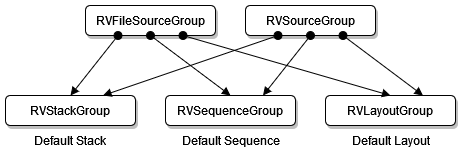
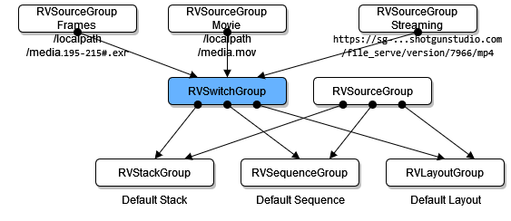

# Using Multiple Media Representations in Open RV

## Introduction

Multiple Media Representations makes it easy for you to swap between media representations in RV.

Multiple Media Representation (MMR) is the implementation of the new OTIO feature named *Media Multiple References*. With RV MMR, you easily switch between the different source media representations referenced by the timeline.

MMR allows you to switch between multiple source media representations since these representations are expressed in the RV graph.

## Swap between source media representations

In RV, the Multiple Media Representations feature allows you to swap between source media representation for any given frame.

To swap source media:

1. Click the Swap drop-down menu.

1. Select the source media to display.

   

You can only select available source media. Any dimmed option is unavailable to you.

By default, there are three possible options.

- **Frames**: for Image sequences, usually OpenEXR.

- **Movie**: for Movie file.

- **Streaming**: for Media streaming.

The resolution and type of media your actually viewing are displayed on the toolbar, next to the Swap Media drop-down.


> Important: During playback, if you lose access to the source media, RV falls back to the next available source media, in this order: Frames > Movie > Streaming(S3).

### How do I know my clip has multiple representations

If the Swap menu appears in the playback area, your clip has multiple media representations. If the menu is not there, the media you see is the only media available and you cannot swap sources.


## Exporting MMR clips to OTIO

When you export a clip to OTIO, the currently selected media representation is set as the active reference in the OTIO file. This requires exporting using a version of OTIO that supports *Media Multiple References*, which means OTIO 0.15 or later. If your version of OTIO does not support MMR, only the current media representation is exported.

For technical information on MMR in OTIO, see [Media Multi-Reference Support](../rv-packages/rv-otio-reader.md#media-multi-reference-support).

## Multiple Media Representations: Technical Details

### Setting Open RV Fall Back Order on Missing Source Media

During playback, if RV loses access to the source media selected by the user, RV falls back to the next available source media. It follows this order: Frames > Movie > Streaming(S3).

You can implement your own fallback order by overloading the package `RV Multiple Source Media Representation Management`. See the package notes for more details.

### Multiple Media Representations Underlying Schema

When *not* using multiple media representations, the RV session is identical to that of previous versions.



When using multiple media representations either with the new `addSourceMediaRep()` command or the new `+mediaRepName` option used together with `addSources()`, `addSourceVerbose()`, or `addSourcesVerbose()`, the `SwitchGroup` gets inserted to connect the different source media representations.



The `SwitchIPNode` is available in older versions of RV. This means that older versions of RV are able to load a new RV session containing multiple media representations.

### New commands

#### string addSourceMediaRep(string sourceNode or "last" for last created source node, string mediaRepName, string[] mediaRepPathsAndOptions=[], string tag=[])

Add a media representation to an existing source specified by sourceNode with an optional tag.

If the source media representation already exists, `addSourceMediaRep()` throws the following error:

```sh
ERROR: Source media representation name already exists: [media representation name]
```

**Returns:**

`string sourceNode` - returns the name of the source node created

**Params:**

`string sourceNode` - The source node for which to add the media representation or "last" for the last created source.

`string mediaRepName` - The name of the media representation to add.

`string[] mediaRepPathsAndOptions` - The paths or URLs of the media representation to add and additional options of the media representation to add, if any.

`string tag` - An optional tag can be provided which is passed to the generated internal events. The tag can indicate the context in which the `addMediaRep()` call is occurring (for example, drag, drop, etc.) It's also possible to add a source media representation in RV without calling `addSourceMediaRep()`:  specify the `mediaRepName` and `mediaRepSource` options to the `addSources()`, `addSourceVerbose()`, or `addSourcesVerbose()` commands.

**Examples:**

```js
rv.commands.addSourceMediaRep("sourceGroup000000_source", "Movie", ["hippo_numbered.mov"])
rv.commands.addSourceMediaRep("sourceGroup000000_source", "Streaming", ["https://www.acme.com/file_serve/version/7966/mp4"])
rv.commands.addSourceMediaRep("sourceGroup000000_source", "Frames", ["hippo_numbered.195-215#.jpg"])
rv.commands.addSourceMediaRep("sourceGroup000000_source", "Movie", ["left.mov", "right.mov"])
rv.commands.addSourceMediaRep("sourceGroup000000_source", "Movie", ["hippo_numbered.mov", "+rs", "194", "+pa", "0.0", "+in", "195", "+out", "215"])
```

`string tag` exemple:

```js
rv.commands.addSourcesVerbose(["image_sequence.195-215#.jpg", "+mediaRepName", "Frames", "+mediaRepSource", "last"])
```

#### void setActiveSourceMediaRep(string sourceNodeOrSwitchNode, string mediaRepName)

Set the active input of the Switch node specified or the ones associated with the specified source node to the given media representation specified by name.

When `sourceNode` is an empty string "", then the media in the first Switch node found at the current frame is swapped with the media representation specified by name.

When `sourceNode` is "all", then the media in all the Switch nodes created with the `rvc.addSourceMediaRep()` command is swapped with the media representation specified by name.

> Note: If the Source Groups do not contain the specified media representation, then `setActiveSourceMediaRep()` throws an error unless `sourceNodeOrSwitchNode` is "" or "all".

- Set the active media representation for the current source to *Streaming*:

  ```js
  rv.commands.setActiveSourceMediaRep("", "Streaming")
  ```

- Set the active media representation for all the sources to *Streaming*:

  ```js
  rv.commands.setActiveSourceMediaRep("all", "Streaming")
  ```

- Set the active media representation for the Switch nodes associated with the specified source to *Streaming*:

  ```js
  rv.commands.setActiveSourceMediaRep("sourceGroup000000_source", "Streaming")
  ```

#### string sourceMediaRep(string sourceNode)

Returns the name of the media representation currently selected by the Switch Group corresponding to the given `RVFileSource` node.

When `sourceNode` is an empty string "", then `sourceMediaRep()` returns the name of the currently selected media representation corresponding to the first Switch node found at the current frame.

#### string[] sourceMediaReps(string sourceNode)

Returns the names of the media representations available for the Switch Group corresponding to the given RVFileSource node.

If `sourceNode` is "", then `sourceMediaReps()` returns all the possible source media representation names.
