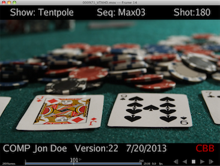
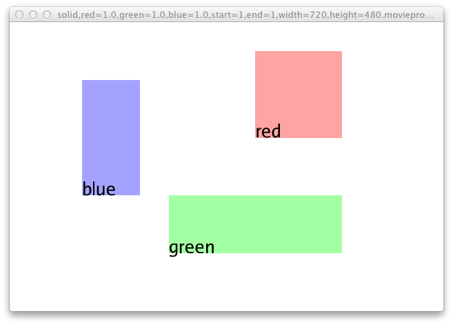

# Chapter 6 - Open RV File Format

The RV file format (.rv) is a text GTO file. GTO is an open source file format which stores arbitrary data — mostly for use in computer graphics applications. The text GTO format is meant to be simple and human readable. It's helpful to have familiarized yourself with the GTO documentation before reading this section. The documentation should come with RV, or you can read it on line at the [GTO](../../rv-manuals/rv-gto.md).

### 6.1 How Open RV Uses GTO

RV defines a number of new GTO object protocols (types of objects). The GTO file is made up of objects, which contain components, which contain properties where the actual data resides. RV's use of the format is to store nodes in an image processing graph as GTO objects. How the nodes are connected is determined by RV and is not currently arbitrary so there are no connections between the objects stored in the file.Some examples of RV object types include:

*   The **RVSession** object (one per file) which stores information about the session. This includes the full frame range, currently marked frames, the playback FPS, and whether or not to use real time playback among other things.
*   **RVLayoutGroup** , **RVFolderGroup, RVSwitchGroup, RVSourceGroup** , **RVRetimeGroup** , **RVStackGroup** , **RVDisplayGroup** and **RVSequenceGroup** nodes which form the top-level of the image processing graph.
*   One or more **RVFileSource** objects each within an **RVSourceGroup** which specify all of the media (movies, audio files, image sequences) which are available in the session.
*   Color correction objects like **RVColor** nodes which are members of **RVSourceGroup** objects.
*   Image format objects like **RVFormat** or **RVChannelMap** which are also members of **RVSourceGroup** objects.
*   An **RVDisplayColor** object (one per file) which indicates monitor gamma, any display LUT being used (and possibly the actual LUT data) which is part of the **RVDisplayGroup** .
*   A **connections** object which contains connections between the top-level group nodes. The file only stores the top-level connections — connections within group nodes are determined by the group node at runtime.

Normally, RV will write out all objects to the session file, but it does not require all of them to create a session from scratch. For example, if you have a file with a single RVFileSource object in it, RV will use that and create default objects for everything else. So when creating a file without RV, it's not a bad idea to only include information that you need instead of replicating the output of RV itself. (This helps make your code future proof as well).The order in which the objects appear in the file is not important. You can also include information that RV does not know about if you want to use the file for other programs as well.

### 6.2 Naming


The names of objects in the session are not visible to the user, however they must follow certain naming naming conventions. There is a separate user interface name for top level nodes which the user does see. The user name can be set by creating a string property on a group node called ui.name.

*   If the object is a group node type other than a source or display group its name can be anything, but it must be unique.
*   If there is an **RVDisplayGroup** in the file it must be called displayGroup.
*   If the object is a member of a group its name should have the pattern: groupName_nodeName where groupName is the name of the group the node is a member of. The nodeName can be anything, but RV will use the type name in lowercase without the “RV” at the front.
*   If the object is a **RVFileSourceGroup** or **RVImageSourceGroup** it should be named sourceGroupXXXXXX where the Xs form a six digit zero padded number. RV will create source groups starting with number 000000 and increment the number for each new source group it creates. If a source group is deleted, RV may reuse its number when creating a new group.
*   The **connection** object should be named connections.
*   The **RVSession** object can have any name.

### 6.3 A Simple Example


The simplest RV file you can create is a one which just causes RV to load a single movie file or image. This example loads a QuickTime file called “test.mov” from the directory RV was started in:

```
 GTOa (3)

sourceGroup000000_source : RVFileSource (0)
{
    media
    {
        string movie =  "test.mov"
    }
} 
```

The first line is required for a text GTO file: it indicates the fact that the file is text format and that the GTO file version is 3. All of the other information (the frame ranges, etc) will be automatically generated when the file is read. By default RV will play the entire range of the movie just as if you dropped it into a blank RV session in the UI. You should name the first **RVFileSource** object sourceGroup000000_source and the second sourceGroup000001_source and the third sourceGroup000002_source, and so on. Eventually we'll want to make an EDL which will index the source objects so the names mostly matter (but not the order in which they appear).Now suppose we have an image sequence instead of a movie file. We also have an associated audio file which needs to be played with it. This is a bit more complicated, but we still only need to make a single **RVFileSource** object:Here we've got test.#.dpx as an image layer and soundtrack.aiff which is an audio layer.

```
 GTOa (3)

sourceGroup000000_source : RVFileSource (0)
{
    media
    {
        string movie = [ "test.#.dpx" "soundtrack.aiff" ]
    }

    group
    {
        float fps =  24
        float volume =  0.5
        float audioOffset = 0.1
    }
} 
```
You can have any number of audio and image sequence/movie files in the movie list. All of them together create the output of the **RVFileSource** object. If we were creating a stereo source, we might have left.#.dpx and right.#.dpx instead of test.#.dpx. When there are multiple image layers the first two default to the left and right eyes in the order in which they appear. You can change this behavior per-source if necessary. The format of the various layers do not need to match.The **group** component indicates how all of media should be combined. In this case we've indicated the FPS of the image sequence, the volume of all audio for this source and an audio slip of 0.1 (one tenth) of a second. Keep in mind that FPS here is for the image sequence(s) in the source it has nothing to do with the playback FPS!. The playback FPS is independent of the input sources frame rate.

#### Aside: What is the FPS of an RVFileSource Object Anyway?

If you write out an RV file from RV itself, you'll notice that the group FPS is often 0! This is a special cookie value which indicates that the FPS should be taken from the media. Movie file formats like QuickTime or AVI store this information internally. So RV will use the frame rate from the media file as the FPS for the source.However, image sequences typically do not include this information (OpenEXR files are a notable exception).. When you start RV from the command line it will use the playback FPS as a default value for any sources created. If there is no playback FPS on startup either via the command line or preferences, it will default to 24 fps. So it's not a bad idea to include the group FPS when creating an RV file yourself when you're using image sequences. If you're using a movie file format you should either use 0 for the FPS or not include it and let RV figure it out.What happens when you get a mismatch between the source FPS and the playback FPS? If there's no audio, you won't notice anything; RV always plays back every frame in the source regardless of the source FPS. But if you have audio layers along with your image sequence or if the media is a movie file, you will notice that the audio is either compressed or expanded in order to maintain synchronization with the images.This is a very important thing to understand about RV: it will always playback every image no matter what the playback FPS is set to; and it will always change the audio to compensate for that and maintain synchronization with the images.So the source FPS is really important when there is audio associated with the images.

### 6.4 Per-Source and Display Color Settings and LUT Files


If you want to include per-source color information – such as forcing a particular LUT to be applied or converting log to linear – you can include only the additional nodes you need with only the parameters that you wish to pass in. For example, to apply a file LUT to the first source (e.g. sourceGroup000000_source) you can create an **RVColor** node similarly named sourceGroup000000_color.

```
 sourceGroup000000_color : RVColor (1)
{
    lut
    {
        string file = "/path/to/LUTs/log2sRGB.csp"
        int active = 1
    }
} 
```

This is a special case in the rv session file: you can refer to a LUT by file. If you have a new-source event bound to a function which modifies incoming color settings based on the image type, any node properties in your session file override the default values created there. To state it another way: values you omit in the session file still exist in RV and will take on whatever values the function bound to new-source made for them. To ensure that you get exactly the color you want you can specify all of the relevant color properties in the **RVColor, RVLinearize,** and **RVDisplayColor** nodes:

```
 sourceGroup000000_colorPipeline_0 : RVColor (2)
{
    color
    {
        int invert = 0
        float[3] gamma = [ [ 1 1 1 ] ]
        string lut = "default"
        float[3] offset = [ [ 0 0 0 ] ]
        float[3] scale = [ [ 1 1 1 ] ]
        float[3] exposure = [ [ 0 0 0 ] ]
        float[3] contrast = [ [ 0 0 0 ] ]
        float saturation = 1
        int normalize = 0
        float hue = 0
        int active = 1
    }

    CDL
    {
        float[3] slope = [ [ 1 1 1 ] ]
        float[3] offset = [ [ 0 0 0 ] ]
        float[3] power = [ [ 1 1 1 ] ]
        float saturation = 1
        int noClamp = 0
    }

    luminanceLUT
    {
        float lut = [ ]
        float max = 1
        int size = 0
        string name = ""
        int active = 0
    }

    "luminanceLUT:output"
    {
        int size = 256
    }
}

sourceGroup000000_tolinPipeline_0 : RVLinearize (1)
{
    lut
    {
        float[16] inMatrix = [ [ 1 0 0 0 0 1 0 0 0 0 1 0 0 0 0 1 ] ]
        float[16] outMatrix = [ [ 1 0 0 0 0 1 0 0 0 0 1 0 0 0 0 1 ] ]
        float lut = [ ]
        float prelut = [ ]
        float scale = 1
        float offset = 0
        string type = "Luminance"
        string name = ""
        string file = ""
        int size = [ 0 0 0 ]
        int active = 0
    }

    color
    {
        string lut = "default"
        int alphaType = 0
        int logtype = 0
        int YUV = 0
        int invert = 0
        int sRGB2linear = 1
        int Rec709ToLinear = 0
        float fileGamma = 1
        int active = 1
        int ignoreChromaticities = 0
    }

    cineon
    {
        int whiteCodeValue = 0
        int blackCodeValue = 0
        int breakPointValue = 0
    }

    CDL
    {
        float[3] slope = [ [ 1 1 1 ] ]
        float[3] offset = [ [ 0 0 0 ] ]
        float[3] power = [ [ 1 1 1 ] ]
        float saturation = 1
        int noClamp = 0
    }
}

defaultOutputGroup_colorPipeline_0 : RVDisplayColor (1)
{
    lut
    {
        float[16] inMatrix = [ [ 1 0 0 0 0 1 0 0 0 0 1 0 0 0 0 1 ] ]
        float[16] outMatrix = [ [ 1 0 0 0 0 1 0 0 0 0 1 0 0 0 0 1 ] ]
        float lut = [ ]
        float prelut = [ ]
        float scale = 1
        float offset = 0
        string type = "Luminance"
        string name = ""
        string file = ""
        int size = [ 0 0 0 ]
        int active = 0
    }

    color
    {
        string lut = "default"
        string channelOrder = "RGBA"
        int channelFlood = 0
        int premult = 0
        float gamma = 1
        int sRGB = 0
        int Rec709 = 0
        float brightness = 0
        int outOfRange = 0
        int dither = 0
        int active = 1
    }

    chromaticities
    {
        int active = 0
        int adoptedNeutral = 0
        float[2] white = [ [ 0.3127 0.329 ] ]
        float[2] red = [ [ 0.64 0.33 ] ]
        float[2] green = [ [ 0.3 0.6 ] ]
        float[2] blue = [ [ 0.15 0.06 ] ]
        float[2] neutral = [ [ 0.3127 0.329 ] ]
    }
} 
```
The above example values assume default color pipeline slots for a single source session. Please see section [12.3](rv-reference-manual-chapter-twelve.md) to learn more about the specific color pipeline groups.

### 6.5 Information Global to the Session


Now let's add an **RVSession** object with in and output points. The session object should be called rv in this version. There should only be one **RVSession** object in the file.

> **Note:** From now on we're just going to show fragments of the file and assume that you can put them all together in your text editor.

```
 rv : RVSession (1)
{
    session
    {
        string viewNode = "defaultSequence"
        int marks = [ 1 20 50 80 100 ]
        int[2] range = [ [ 1 100 ] ]
        int[2] region = [ [ 20 50 ] ]
        float fps =  24
        int realtime =  1
        int currentFrame =  30
    }
} 
```
Assuming this was added to the top of our previous file with the source in it, the session object now indicates the frame range (1-100) and an in and out region (20-50) which is currently active. Frames 1, 20, 50, 80, and 100 are marked and the default frame is frame 30 when RV starts up. The realtime property is a flag which indicates that RV should start playback in real time mode. The view node indicates what will be viewed in the session when the file is opened.Note that it's usually a good idea to skip the frame range boundaries unless an EDL is also specified in the file (which is not the case here). RV will figure out the correct range information from the source media. If you force the range information to be different than the source media's you may get unexpected results. The marks and range can also be stored on each viewable top-level object. For example the defaultLayout and defaultSequence can have different marks and in and out points:

```
 defaultStack : RVStackGroup (1)
{
    session
    {
        float fps = 24
        int marks = [ ]
        int[2] region = [ [ 100 200 ] ]
        int frame = 1
    }
}
 
```
If a group has a session component than the contents can provide an in/out region, marks, playback fps and a current frame. When the user views the group node these values will become inherited by the session.

### 6.6 The Graph


Internally, RV holds a single image processing graph per session which is represented in the session file. The graph can have multiple nodes which determine how the sources are combined. These are the top-level nodes and are always group nodes. The user can create new top-level nodes (like sequences, stacks, layouts, retimings, etc). So the inputs for each node need to be stored in order to reproduce what the user created. The connections between the top-level group nodes are stored in the connections object and includes a list of the top level nodes. For example, this is what RV will write out for a session with a single source in it:

```
 connections : connection (1)
{
    evaluation
    {
        string lhs = [ "sourceGroup000000"
                       "sourceGroup000000"
                       "sourceGroup000000" ]

        string rhs = [ "defaultLayout"
                       "defaultSequence"
                       "defaultStack" ]
    }

    top
    {
        string nodes = [ "sourceGroup00000",
                         "defaultLayout",
                         "defaultStack",
                         "defaultSequence" ]
    }
} 
```
The connections should be interpreted as arrows between objects. The lhs (left hand side) is the base of the arrow. The rhs (right hand side) is the tip. The base and tips are stored in separate properties. So in the case, the file has three connections:

> **Note:** RV may write out a connection to the display group as well. However, that connection is redundant and may be overridden by the value of the view node property in the RVSession.

1.  sourceGroup000000 → defaultLayout
2.  sourceGroup000000 → defaultSequence
3.  sourceGroup000000 → defaultStack

The nodes property, if it exists, will determine which nodes are considered top level nodes. Otherwise, nodes which include connections and nodes which have user interface name are considered top level.

#### 6.6.1 Default Views

There are three default views that are always created by RV: the default stack, sequence, and layout. Whenever a new source is added by the user each of these will automatically connect the new source as an input. When a new viewing node is created (a new sequence, stack, layout, retime) the default views will not add those —- only sources are automatically added.When writing a .rv file you can co-opt these views to rearrange or add inputs or generate a unique EDL but it's probably a better idea to create a new one instead; RV will never automatically edit a sequence, stack, layout, etc, that is not one of the default views.

### 6.7 Creating a Session File for Custom Review


One of the major reasons to create session files outside of RV is to automatically generate custom review workflows. For example, if you want to look at an old version of a sequence and a new version, you might have your pipeline output a session file with both in the session and have pre-constructed stacked views with wipes and a side-by-side layout of the two sequences.To start with lets look at creating a session file which creates a unique sequence (not the default sequence) with plays back sources in a particular order. In this case, no EDL creation is necessary — we only need to supply the sequence with the source inputs in the correct order. This is analogous to the user reordering the inputs on a sequence in the user interface.This file will have an RVSequenceGroup object as well as the sources. Creating sources is covered above so we'll skip to the creation of the RVSequenceGroup. For this example we'll assume there are three sources and that they all have the same FPS (so no retiming is necessary). We'll let RV handle creation of the underlying RVSequence and its EDL and only create the group:

```
// define sources ...

reviewSequence : RVSequenceGroup (1)
{
    ui { string name = "For Review" }
}

connections : connection (1)
{
    evaluation
    {
        string lhs = [ "sourceGroup000002"
                       "sourceGroup000000"
                       "sourceGroup000001" ]

        string rhs = [ "reviewSequence"
                       "reviewSequence"
                       "reviewSequence" ]
    }
} 
```
RV will automatically connect up the default views so we can skip their inputs in the connections object for clarity. In this case, the sequence is connected up so that by default it will play sourceGroup000002 followed by sourceGroup000000 followed by sourceGroup000001 because the default EDL of a sequence just plays back the inputs in order. Note that for basic ordering of playback, no EDL creation is necessary. We could also create additional sequence groups with other inputs. Also note the use of the UI name in the sequence group.Of course, the above is not typical in a production environment. Usually there are handles which need to (possibly) be edited out. There are two ways to do this with RV: either set the cut points in each source and tell the sequence to use them, or create an EDL in the sequence which excludes the handles.To start with we'll show the first method: set the cut points. This method is easy to implement and the sequence interface has a button on it that lets the user toggle the in/out cuts on/off in realtime. If the user reorders the sequence, the cuts will be maintained. When using this method any sequence in the session can be made to use the same cut information — it propagates down from the source to the sequence instead of being stored for each sequence.Setting the cut in/out points requires adding a property to the RVFileSource objects and specifying the in and out frames:

```
sourceGroup000000_source : RVFileSource (1)
{
    media { string movie = "shot00.mov" }

    cut
    {
        int in = 8
        int out = 55
    }
}

sourceGroup000001_source : RVFileSource (1)
{
    media { string movie = "shot01.mov" }

    cut
    {
        int in = 5
        int out = 102
    }
}

sourceGroup000002_source : RVFileSource (1)
{
    media { string movie = "shot02.mov" }

    cut
    {
        int in = 3
        int out = 22
    }
}
 
```
Finally, the most flexibly way to control playback is to create an EDL. The EDL is stored in an RVSequence node which is a member of the RVSequenceGroup. Whenever an RVSequenceGroup is created, it will create a sequence node to hold the EDL. If you are not changing the default values or behavior of the sequence node it's not necessary to specify it in the file. In this case, however we will be creating a custom EDL.

#### 6.7.1 RVSequence

The sequence node can be in one of two modes: auto EDL creation or manual EDL creation. This is controlled by the mode.autoEDL property. If the property is set to 1 then the sequence will behave like so:

*   If a new input is connected, the existing EDL is erased and a new EDL is created.
*   Each input of the sequence will have a cut created for it in the order that they appear. If mode.useCutInfo is set, the sequence will use the cut information coming from the input to determine the cut in the EDL. Otherwise it will use the full range of the input.
*   If cut info changes on any input to the sequence, the EDL will be adjusted automatically.

When auto EDL is not on, the sequence node behavior is not well-defined when the inputs are changed. In future, we'd like to provide more interface for EDL modification (editing) but for the moment, a custom EDL should only be created programmatically in the session file.For this next example, we'll use two movie files: a.mov and b.mov. They have audio so there's nothing interesting about their source definitions: just the media property with the name of the movie . They are both 24 fps and the playback will be as well:

> **Note:** The example RV file has fewer line breaks than one which RV would write. However, it's still valid.

```
 GTOa (3)

rv : RVSession (2)
{
    session
    {
        string viewNode = "mySequence"
    }
}

sourceGroup000000_source : RVFileSource (0) { media { string movie =  "a.mov" } }
sourceGroup000001_source : RVFileSource (0) { media { string movie =  "b.mov" } }

connections : connection (1)
{
    evaluation
    {
        string lhs = [ "sourceGroup000000"
                       "sourceGroup000001" ]
        string rhs = [ "mySequence"
                       "mySequence" ]
    }
}

mySequence : RVSequenceGroup (0)
{
    ui
    {
        string name = "GUI Name of My Sequence"
    }
}

mySequence_sequence : RVSequence (0)
{
    edl
    {
        int frame  = [  1 11 21 31 41 ]
        int source = [  0  1  0  1  0 ]
        int in     = [  1  1 11 11  0 ]
        int out    = [ 10 10 20 20  0 ]
    }

    mode
    {
        int autoEDL = 0
    }
}  
```
The source property indexes the inputs to the sequence node. So index 0 refers to sourceGroup000000 and index 1 refers to sourceGroup000001. This EDL has four edits which are played sequentially as follows:

1.  a.mov, frames 1-10
2.  b.mov, frames 1-10
3.  a.mov, frames 11-20
4.  b.mov, frames 11-20

You can think of the properties in the sequence as forming a transposed matrix in which the properties are columns and edits are rows as in [6.1](rv-reference-manual-chapter-six.md#edl-as-matrix). Note that there are only 4 edits even though there are 5 rows in the matrix. The last edit is really just a boundary condition: it indicates how RV should handle frames past the end of the EDL. To be well formed, an RV EDL needs to include this.Note that the in frame and out frame may be equal to implement a “held” frame.

|  | global start frame | source | in | out |
| --- | --- | --- | --- | --- |
| edit #1 | 1 | a.mov | 1 | 10 |
| edit #2 | 11 | b.mov | 1 | 10 |
| edit #3 | 21 | a.mov | 11 | 20 |
| edit #4 | 31 | b.mov | 11 | 20 |
| past end | 41 | a.mov | 0 | 0 |

Table 6.1:EDL as Matrix <a id="edl-as-matrix"></a>

#### 6.7.2 RVLayoutGroup and RVStackGroup

The stack and layout groups can be made in a similar manner to the above. The important thing to remember is the inputs for all of these must be specified in the connections object of the file. Each of these view types uses the input ordering; in the case of the stack it determines what's on top and in the case of the layout it determines how automatic layout will be ordered.

#### 6.7.3 RVOverlay

Burned in metadata can be useful when creating session files. Shot status, artist, name, sequence, and other static information can be rendered on top of the source image directly by RV's render. Figure [6.1](#metadata-rendered-by-rvoverlay-node-from-session-file) shows an example of metadata rendered by the RVOverlay node.



Figure 6.1:Metadata Rendered By RVOverlay Node From Session File <a id="metadata-rendered-by-rvoverlay-node-from-session-file"></a>

Each RVSourceGroup can have an RVOverlay node. The RVOverlay node is used for matte rendering by user interface, but it can do much more than that. The RVOverlay node currently supports drawing arbitrary filled rectangles and text in addition to the mattes. The text and filled rectangle are currently limited to static shapes and text. Text and rectangles rendered in this fashion are considered part of the image by RV. If you pass a session file with an active RVOverlay node to rvio it will render the overlay the same way RV would. This is completely independent of any rvio overlay scripts which use a different mechanism to generate overlay drawings and text.Figure [6.2](#rvoverlay-node-example) shows an example which draws three colored boxes with text starting at each box's origin.



Figure 6.2:RVOverlay Node Example <a id="rvoverlay-node-example"></a>

The session file used to create the example contains a movieproc source (white 720x480 image) with the overlay rendered on top of it. Note that the coordinates are normalized screen coordinates relative to the source image:

```
 GTOa (3)

sourceGroup1_source : RVFileSource (1)
{
    media
    {
        string movie = "solid,red=1.0,green=1.0,blue=1.0,start=1,end=1,width=720,height=480.movieproc"
    }
}

sourceGroup1_overlay : RVOverlay (1)
{
    overlay
    {
        int show = 1
    }
    "rect:red"
    {
        float width = 0.3
        float height = 0.3
        float[4] color = [ [ 1.0 0.1 0.1 0.4 ] ]
        float[2] position = [ [ 0.1 0.1 ] ]
    }
    "rect:green"
    {
        float width = 0.6
        float height = 0.2
        float[4] color = [ [ 0.1 1.0 0.1 0.4 ] ]
        float[2] position = [ [ -0.2 -0.3 ] ]
    }
    "rect:blue"
    {
        float width = 0.2
        float height = 0.4
        float[4] color = [ [ 0.1 0.1 1.0 0.4 ] ]
        float[2] position = [ [ -0.5 -0.1 ] ]
    }
    "text:red"
    {
        float[2] position = [ [ 0.1 0.1 ] ]
        float[4] color = [ [ 0 0 0 1 ] ]
        float spacing = 0.8
        float size = 0.005
        float scale = 1
        float rotation = 0
        string font = ""
        string text = "red"
        int debug = 0
    }
    "text:green"
    {
        float[2] position = [ [ -0.2 -0.3 ] ]
        float[4] color = [ [ 0 0 0 1 ] ]
        float spacing = 0.8
        float size = 0.005
        float scale = 1
        float rotation = 0
        string font = ""
        string text = "green"
        int debug = 0
    }
    "text:blue"
    {
        float[2] position = [ [ -0.5 -0.1 ] ]
        float[4] color = [ [ 0 0 0 1 ] ]
        float spacing = 0.8
        float size = 0.005
        float scale = 1
        float rotation = 0
        string font = ""
        string text = "blue"
        int debug = 0
    }
}

```

Components in the RVOverlay which have names starting with “rect:” are used to render filled rectangles. Components starting with “text:” are used for text. The format is similar to that used by the RVPaint node, but the result is rendered for all frames of the source. The reference manual contains complete information about the RVOverlay node's properties and how the control rendering.

### 6.8 Limitations on Number of Open Files


RV does not impose any artificial limits on the number of source which can be in an RV session file. However, the use of some file formats, namely Quicktime .mov, .avi, and .mp4, require that the file remain open while RV is running.Each operating system (and even shell on Unix systems) has different limits on the number of open files a process is allowed to have. For example on Linux the default is 1024 files. This means that you cannot open more than 1000 or so movie files without changing the default. RV checks the limit on startup and sets it to the maximum allowed by the system.There are a number of operating system and shell dependent ways to change limits. Your facility may also have limits imposed by the IT department for accounting reasons.

### 6.9 What's the Best Way to Write a .rv (GTO) File?


GTO comes in three types: text (UTF8 or ASCII), binary, and compressed binary. RV can read all three types. RV normally writes text files unless an **RVImageSource** is present in the session (because an image was sent to it from another process instead of a file). In that case it will write a compressed binary GTO to save space on disk.If you think you might want to generate binary files in addition to text files you can do so using the GTO API in C++ or python. However, the text version is simple enough to write using only regular I/O APIs in any language. We recommend you write out .rv session files from RV and look at them in an editor to generate templates of the portions that are important to you. You can copy and paste parts of session files into source code as strings or even shell scripts as templates with variable substitution.
