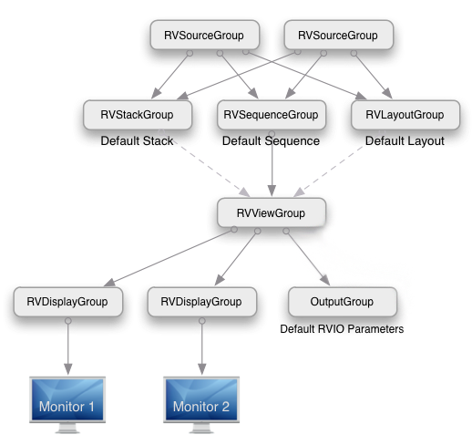
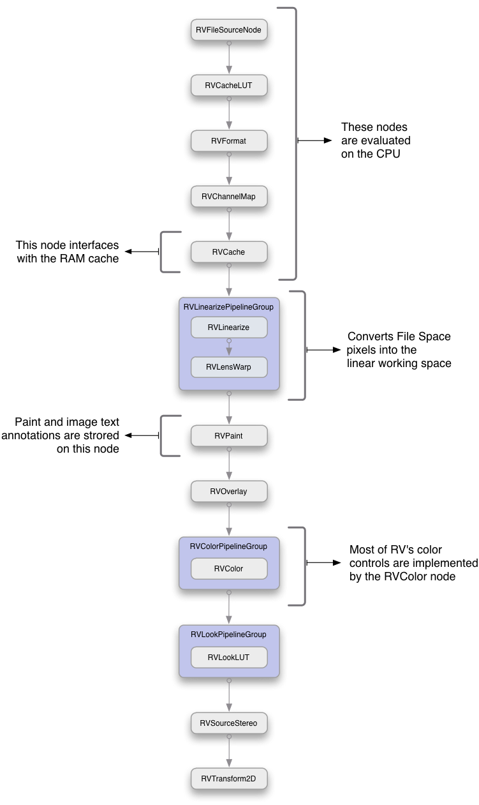
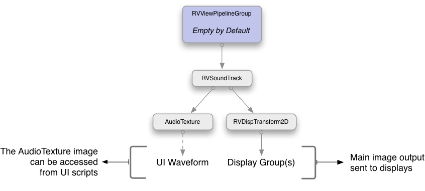
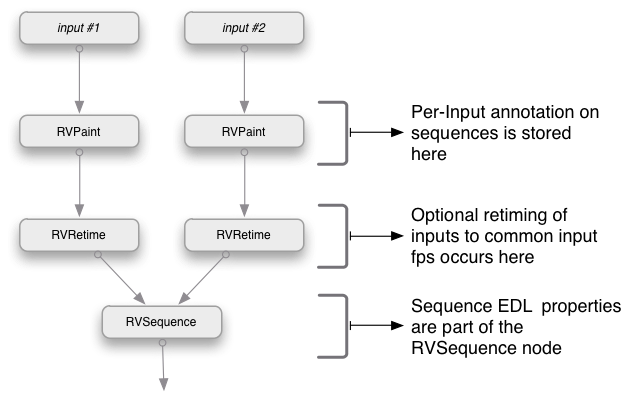
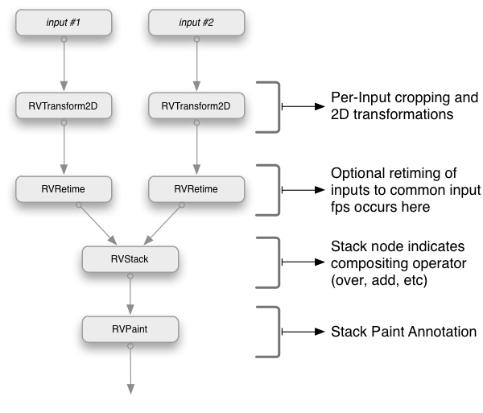
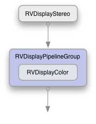
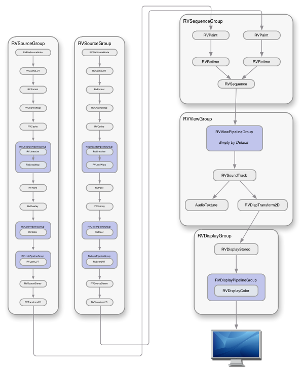

# Chapter 2 - Image Processing Graph

The UI needs to communicate with the core part of RV. This is done in two ways: by calling special command functions (commands) which act directly on the core (e.g. play() causes it to start playing), or by setting variables in the underlying image processing graph which control how images will be rendered.Inside each session there is a *directed acyclic graph* (DAG) which determines how images and audio will be evaluated for display. The DAG is composed of *nodes* which are themselves collections of *properties* .A node is something that produces images and/or audio as output from images and audio inputs (or no inputs in some cases). An example from RV is the *color* node; the color node takes images as input and produces images that are copies of the input images with the hue, saturation, exposure, and contrast potentially changed.A *property* is a state variable. The node's properties as a whole determine how the node will change its inputs to produce its outputs. You can think of a node's properties as *parameters* that change its behavior.RV's session file format (.rv file) stores all of the nodes associated with a session including each node's properties. So the DAG contains the complete state of an RV session. When you load an .rv file into RV, you create a new DAG based on the contents of the file. Therefore, *to change anything in RV that affects how an image looks, you must change a property in some node in its DAG* .There are a few commands which RV provides to get and set properties: these are available in both Mu and Python.Finally, there is one last thing to know about properties: they are arrays of values. So a property may contain zero values (it's empty) or one value or an array of values. The get and set functions above all deal with arrays of numbers even when a property only has a single value.[16](rv-reference-manual-chapter-sixteen.md#chapter-16-node-reference) lists all properties and their function for each node type.

## 2.1 Top-Level Node Graph

When RV is started with e.g. two media (movies, file sequences) it will create two top-level group nodes: one for each media source. These are called RVSourceGroup nodes. In addition, there are four other top-level group nodes created and one display group node for each output device present on the system.



Figure 2.1:Top-Level node graph when two sources are present.

There is always a default layout (RVLayoutGroup), sequence (RVSequenceGroup), and stack node (RVStackGroup) as well as a view group node (RVViewGroup). The view group is connected to each of the active display groups (RVDisplayGroup). There is only one input to the view group and that input determines what the user is seeing in the image viewer. When the user changes views, the view group input is switch to the node the user wishes to see. For example, when the user looks at one of the sources (not in a sequence) the view group will be connected directly to that source group.New top level nodes can be created by the user. These nodes can have inputs of any other top level node in the session other than the view group and display groups.In the scripting languages, the nodes are referred to by internal name. The internal name is not normally visible to the user, but is used extensively in the session file. Most of the node graph commands use internal node names or the name of the node's type.

| Command | Mu Return Type | Python Return Type | Description |
| --- | --- | --- | --- |
| nodes() | string[] | Unicode String List | Returns an array of all nodes in the graph. |
| nodesOfType (string *typename* ) | string[] | Unicode String List | Returns all nodes in the graph of the specified type |
| nodeTypes() | string[] | Unicode String List | Returns an array of all node types known to the application |
| nodeType (string *nodename* ) | string | Unicode String | Returns the type of the node specified by *nodename* |
| deleteNode (string *nodename* ) | void | None | Deletes the node specified by *nodename* |
| setViewNode (string *nodename* ) | void | None | Connect the specified node to the view group |
| newNode (string *typename* , string *nodename* = nil) | string | Unicode String | Create a node of type *typename* with name *nodename* or if *nodename* is nil use a default name |
| nodeConnections (string *nodename* , bool *traverseGroups* = false) | (string[],string[]) | Tuple of two Unicode String Lists | Return a tuple of nodes connected to the specified node: the first as an array of input node names, the second as an array of output node names. |
| nodesExists (string *nodename* ) | bool | Bool | Returns true if the specified node exists false otherwise |
| setNodeInputs (string *nodename* , string[] *inputNodes* ) | void | None | Connect a nodes inputs to an array of node names |
| testNodeInputs (string *nodename* , string[] *inputNodes* ) | string | Unicode String | Test the validity of a set of input nodes for *nodename* . If nil is returned than the inputs are valid. If a string is returned than the inputs are not valid and the string contains a user readable reason why they are not. |

Table 2.1:Commands used to manage nodes in the graph

### 2.2 Group Nodes and Pipeline Groups

A group node is composed of multiple member nodes. The graph connectivity is determined by the value of the group node's properties or it is fixed. Group nodes can contain other group nodes. The member nodes are visible to the user interface scripting languages and their node names are unique in the graph. Nodes may only be connected to nodes that are members of the same group. In the case of top level nodes they can be connected to other top level nodes.

A pipeline group is a type of group node that connects it members into a single pipeline (no branches). Every pipeline group has a string array property called pipeline.nodes which determines the types of the nodes in the pipeline and the order in which they are connected. Any node type other than view and display group nodes can be specified in the pipeline.nodes property.Each type of pipeline group has a default pipeline. Except for the RVLinearizePipelineGroup which has two nodes in its default pipeline all others have a single node with the exception of the view pipeline which is empty by default. By modifying the pipeline.nodes property in any of these pipeline groups the default member nodes can either be swapped out, removed completely, or additional nodes can be inserted.For example. the following python code will set the view pipeline to use a user defined node called “FilmLook”:

```
 setStringProperty("#RVViewPipelineGroup.pipeline.nodes", ["FilmLook"], True) 
```

### 2.3 Source Group Node

The source group node (RVSourceGroup) has fixed set of nodes and three pipeline groups which can be modified to customize the source color management.



Figure 2.2: Source Group Internals

The source group takes no inputs. There is eiher an RVFileSource or an RVImageSource node at the leaf position of the source group. A file source contains the name of the media that is provided by the source. An image source contains raw pixels of its media (usually obtained directly from a renderer etc).The source group is responsible for linearizing the incoming pixel data, possibly color correcting it and applying a look, and holding per-source annotation and transforms. Any of these operations can be modified by changing property values on the member nodes of the source group.Pixels are expected to be in the working space (normally linear) after existing the source group.

| Command | Mu Return Type | Python Return Type | Description |
| --- | --- | --- | --- |
| sources () | (string,int,int,intfloat,bool,bool)[] | Same | Returns an array of media info for all loaded media. |
| sourcesAtFrame (int *frame* ) | string[] | String Array | Returns array of source node names (RVFileSource and/or RVImageSource). This is equivalent to nodesOfType(“RVSource”) |
| sourceAttributes (string *nodename* , string *medianame* = nil) | (string,string)[] | Array of (String,String) | Returns an array of image attribute name/value pairs at the current frame. The sourceName can be the node name or the source path as returned by PixelImageInfo, etc. The optional media argument can be used to constraint the attributes to that media only. |
| sourceMediaInfo (string *nodename* , string *medianame* = nil) | SourceMediaInfo | Dictionary | Returns a SourceMediaInfo structure for the given source and optional media. The SourceMediaInfo supplies geometric and timing information about the image and sequence |
| sourceDisplayChannelNames (string *nodename* ) | string[] | String Array | Returns the names of channels in a source which are mapped to the display RGBA channels |
| addSource (string *filename* , string tag = nil) | void | None | Creates a new source group with the specified media |
| addSource (string[] *filename* s, string tag = nil) | void | None | Creates a new source group with the specified media |
| addSourceBegin() | void | None | Optional call providing a fast add source mechanism when adding multiple sources which postpones connecting the added sources to the default views' inputs until after the corresponding addSourceEnd() is called. The way to enable this optimization is to call addSourceBegin() first, followed by a bunch of addSource() calls, and then end with addSourceEnd(). |
| addSourceEnd() | void | None | Optional call providing a fast add source mechanism when adding multiple sources which postpones connecting the added sources to the default views' inputs until after the corresponding addSourceEnd() is called. The way to enable this optimization is to call addSourceBegin() first, followed by a bunch of addSource() calls, and then end with addSourceEnd(). |
| addSources(string[] sources, string tag = “”, bool processOpts = false, bool merge = false) | void | None | Add a new source group to the session (see addSource). This function adds the requested sources asynchronously. In addition to the "incoming-source-path" and "new-source" events generated for each source. A "before-progressive-loading" and "after-progressive-loading" event pair will be generated at the appropriate times. An optional tag can be provided which is passed to the generated internal events. The tag can indicate the context in which the addSource() call is occurring (e.g. drag, drop, etc). The optional processOpts argument can be set to true if there are 'option' states like -play, that should be processed after the loading is complete.Note that sources can be single movies/sequences or you can use the "[]" notation from the command line to specify multiple files for the source, like stereo layers, or additional audio files. Per-source command-line flags can also be used here, but the flags should be marked by a "+" rather than a "-". Also note that each argument is a separate element of the input string array.  <br> For example a single stereo source might look like string[] {"[", "left.mov", "right.mov", "+rs", "1001", "]" } |
| addSourceVerbose (string *filename* [], string tag = nil) | string | String | Creates a new source group with the specified media. Returns the name of the source node created. |
| addToSource (string *filename* , string tag = nil) | void | None | Adds media to an existing source group |
| addToSource (string[] *filename* s, string tag = nil) | void | None | Adds media to an existing source group |
| setSourceMedia (string *nodename* , string[] *filename* s, string tag = nil) | void | None | Replace all media in the given RVFileSource node with new media with optional tag |
| relocateSource (string *nodename* , string *oldfilename* s, string *newfilename* ) | void | None | Replace media (one) in the specified RVFilesSource source with new media |
| relocateSource (string *oldfilename* s, string *newfilename* ) | void | None | Replace media (one) in the current RVFilesSource source with new media |
| newImageSource (string *mediaName* , int *width* , int *height* , int *uncropWidth* , int *uncropHeight* , int *uncropX* , int *uncropY* , float *pixelAspect* , int *channels* , int *bitsPerChannel* , bool *floatingPoint* , int *startFrame* , int *endFrame* , float *fps* , string[] *layers* = nil, string[] *views* = nil ) | string | String | Create a new source group with an image source as the media. The name of the newly created image source node is returned. |
| sourceMedia (string *nodename* ) | (string,string[],string[]) | Same | Returns tuples describing media in nodename. This command only returns information about the primary media and is deprecated. Use sourceMediaInfo() instead. |

Table 2.2:Commands used to manage and create source groups

#### 2.3.1 Progressive Source Loading

If you need to, RV can load sources asynchronously, also known as progressive source loading. Progessive source loading is turned off by default.

**Use one of these methods to enable asynchronous source loading:**

- With the command line argument: `-progressiveSourceLoading 1`
- With the environment variable: `RV_PROGRESSIVE_SOURCE_LOADING`
- Execute the following command in an RV Python package:
```python
from rv import commands as rvc
rvc.setProgressiveSourceLoading(True)
```

> Note: `setProgressiveSourceLoading` affects the behaviour of the following scripting commands:
>
> - addSource()
> - addSources()
> - addSourceVerbose()
> - addSourcesVerbose()

When progressive source loading is disabled (default setting), the sources are loaded synchronously. This creates the sequence of events:

1. before-progressive-loading
1. source-group-complete media 1
1. source-group-complete media 2
1. after-progressive-loading

When progressive source loading is enabled, RV loads the sources asynchronously:

1. RV creates a movie placeholder in the graph called a movieProxie which has a default duration of 20 frames.
1. It dispatches the actual loading of the media as a work item to a pool of worker threads.
1. Once the media completes the loading operation, the movieProxie placeholder is replaced with the actual movie.

You can expect this sequence of events:

1. before-progressive-loading
1. before-progressive-proxy-loading
1. source-group-proxy-complete media_1
1. source-group-proxy-complete media_2
1. after-progressive-proxy-loading
1. source-group-complete media 1
1. source-group-complete media 2
1. after-progressive-loading

Enabling progressive source loading significantly increases the complexity of scripting. Consider the following example:

```python
rv.commands.addSource('/my/clip/1')
rv.commands.setFPS(60.00)
```

- With progressive source loading disabled (default setting), the script behaves as expected: the source is loaded with a frame rate set at 60 fps.

- With progressive source loading enabled, the script doesn't behave as expected. While the source is loaded asynchronously, the frame rate is set temporarily to 60 fps. It's only once the source is completely loaded that the frame rate is set to the source's native rate.

`progressiveSourceLoading` returns the loading state of the current progressive source.

#### 2.3.2 Deleting a Source

When you allocate a new source with `addSource()`, or one of its variants such as `addSourceVerbose()`, RV actually allocates a source group under the hood but only returns the RVFileSource node. Using `deleteNode()` on the returned RVFileSource node deletes the node but not the source group that was created.

To properly delete a source, you must delete its associated source group by using the following:

```py
rv.commands.deleteNode(rv.commands.nodeGroup(<loaded_node>))
```

If you prefer, you can instead clear all the sources from the current session with `rv.commands.clearSession()`.

### 2.4 View Group Node

The view group (RVViewGroup) is responsible for viewing transforms and is the final destination for audio in most cases. The view group is also responsible for rendering any audio waveform visualization.Changing the view in RV is equivalent to changing the input of the view group. There is only one view group in an RV session.The view group contains a pipeline into which arbitrary nodes can be inserted for purposes of QC and visualization. By default, this pipeline is empty (it has no effect).



Figure 2.3:View Group Internals

| Command | Mu Return Type | Python Return Type | Description |
| --- | --- | --- | --- |
| setViewNode (string *nodename* ) | void | None | Connect the specified node to the view group |
| nextViewNode () | void | None | Switch to next view in the view history (if there is one) |
| prevViewNode () | void | None | Switch to next previous in the view history (if there is one) |

Table 2.3:High level commands used to change the view group inputs

### 2.5 Sequence Group Node

The sequence group node causes its inputs to be rendered one after another in time.The internal RVSequence node contains an EDL data structure which determines the order and possibly the frame ranges for its inputs. By default the EDL is automatically created by sequencing the inputs in order from the first to last with their full frame ranges. The automatic EDL function can be turned off in which case arbitrary EDL data can be set including cuts back to a single source multiple times.Each input to a sequence group has a unique sub-graph associated with it that includes an RVPaint node to hold annotation per input and an optional retime node to force all input media to the same FPS.



Figure 2.4:Sequence Group Internals

### 2.6 Stack Group Node

The stack group node displays its inputs on top of each other and can control a crop per input in order to allow pixels from lower layers to be seen under upper layers. Similar to a sequence group, the stack group contains an optional retime node per input in order to force all of the input FPS' to the same value.Unlike the sequence group, the stack group's paint node stores annotation after the stacking so it always appears on top of all images.



Figure 2.5:Stack Group Internals

### 2.7 Layout Group Node

The layout group is similar to a stack group, but instead of showing all of its inputs on top of one another, the inputs are transformed into a grid, row, column, or under control of the user (manually). Like the other group nodes, there is an optional retime node to force all inputs to a common FPS. Annotations on the layout group appear on top of all images regardless of their input order.


Figure 2.6:Layout Group Internals

### 2.8 Display Group Node

There is one display group for each video device accessible to RV. For example in the case of a dual monitor setup, there would be two display groups: one for each monitor. The display group has two functions: to prepare the working space pixels for display on the associated device and to set any stereo modes for that device.By default the display group's pipeline uses an RVDisplayColor node to provide the color correction. The user can use any node for that purpose instead or in addition to the existing RVDisplayColor. For example, when OpenColorIO is being used a DisplayOCIONode is used in place of the RVDisplayColor.For a given desktop setup with multiple monitors only one of the RVDisplayGroups is active at a time: the one corresponding to the monitor that RV's main window is on. In presentation mode, two RVDisplayGroups will be active: one for RV's main window and one for the presentation device. Each display group has properties which identify their associated device.Changes to a display group affect the color and stereo mode for the associated device only. In order to make a global color change that affects all devices, a node should be inserted into the view group's pipeline or earlier in the graph.



Figure 2.7:Display Group Internals

### 2.9 Addressing Properties

A full property name has three parts: the node name, the component name, and the property name. These are concatenated together with dots like *nodename.componentname.propertyname* . Each property has its own type which can be set and retrieved with one of the set or get functions. You must use the correct get or set function to access the property. For example, to set the display gamma, which is part of the \`\`display” node, you need to use setFloatProperty() like so in Mu:

```
 setFloatProperty("display.color.gamma", float[] {2.2, 2.2, 2.2}, true) 
```

or in Python:

```py
setFloatProperty("display.color.gamma",  [2.2, 2.2, 2.2], True) 
```

In this case the value is being set to 2.2.



Figure 2.8:Conceptual diagram of RV Image and Audio Processing Graph for a session with a single sequence of two sources. The default stack and layout are not included in this diagram, but would be present. <a id="rv-pipeline-small"></a>

In an RV session, some node names will vary per the source(s) being displayed and some will not. Figure [2.8](#rv-pipeline-small) shows a pipeline diagram for one possible configuration and indicates which are per-source (duplicated) and which are not.At any point in time, a subset of the graph is active. For example if you have three sources in a session and RV is in sequence mode, at any given frame only one source branch will be active. There is a second way to address nodes in RV: by their types. This is done by putting a hash (#) in front of the type name. Addressing by node type will affect all of the currently active nodes of the given type. For example, a property in the color node is exposure which can be addressed directly like this in Mu:

```
color.color.exposure 
```

or using the type name like this:

```
#RVColor.color.exposure 
```

When the “#” type name syntax is used, and you use one of the set or get functions on the property, only nodes that are currently active and which are the first reachable of the given type will be considered. So in this case, if we were to set the exposure using type-addressing:

```
setFloatProperty("#RVColor.color.exposure", float[] {2.0, 2.0, 2.0}, true) 
```

or in Python:

```py
setFloatProperty("#RVColor.color.exposure", [2.0, 2.0, 2.0], True) 
```

In sequence mode (i.e. the default case), only one RVColor node is usually active at a time (the one belonging to the source being viewed at the current frame). In stack mode, the RVColor nodes for all of the sources could be active. In that case, they will all have their exposure set. In the UI, properties are almost exclusively addressed in this manner so that making changes affects the currently visible sources only. See figure [2.9](#active-nodes-in-the-image-processing-graph) for a diagrammatic explanation.


Figure 2.9: Active Nodes in the Image Processing Graph <a id="active-nodes-in-the-image-processing-graph"></a>

The active nodes are those nodes which contribute to the rendered view at any given frame. In this configuration, when the sequence is active, there is only one source branch active (the yellow nodes). By addressing properties using their node's type name, you can affect only active nodes with that type without needing search for the exact node(s).There is an additional shorthand using “@” in front of a type name:

```
@RVDisplayColor.color.brightness 
```

The above would affect only the first RVDisplayColor node it finds instead of all RVDisplayColor nodes of depth 1 like “#” does. This is useful with presentation mode for example because setting the brightness would be confined to the first RVDisplayColor node which would be the one associated with the presentation device. If “#” was used, all devices would have their brightness modified. The utility of the “@” syntax is limited compared to “#” so if you are unsure of which to use try “#” first.Chapter [16](rv-reference-manual-chapter-sixteen.md#chapter-16-node-reference) has all the details about each node type.

### 2.10 User Defined Properties

It's possible to add your own properties when creating an RV file from scratch or from the user interface code using the newProperty() function.Why would you want to do this? There are a few reasons to add a user defined property:

1. You wish to save something in a session file that was created interactively by the user.
1. You're generating session files from outside RV and you want to include additional information (e.g. production tracking, annotations) which you'd like to have available when RV plays the session file.

Some of the packages that come with RV show how to implement functionality for the above.

### 2.11 Getting Information From Images

RV's UI often needs to take actions that depend on the context. Usually the context is the current image being displayed. Table [2.4](#command-functions-for-querying-displayed-images) shows the most useful command functions for getting information about displayed images.

| Command | Description |
| --- | --- |
| sourceAtPixel | Given a point in the view, returns a structure with information about the source(s) underneath the point. |
| sourcesRendered | Returns information about all sources rendered in the current view (even those that may have been culled). |
| sourceLayers | Given the name of a source, returns the layers in the source. |
| sourceGeometry | Given the name of a source, returns the geometry (bounding box) of that source. |
| sourceMedia | Given the name of a source, returns the a list of its media files. |
| sourcePixelValue | Given the name of a source and a coordinate in the image, returns an RGBA pixel value at that coordinate. This function may convert chroma image pixels to Rec709 primary RGB in the process. |
| sourceAttributes | Given the name of a source and optionally the name a particular media file in the source, returns an array of tuples which contain attribute names and values. |
| sourceStructure | Given the name of a source and optionally the name a particular media file in the source, returns information about image size, bit depth, number of channels, underlying data type, and number of planes in the image. |
| sourceDisplayChannelNames | Given the name of a source, returns an array of channel names current being displayed. |

Table 2.4: Command Functions for Querying Displayed Images <a id="command-functions-for-querying-displayed-images"></a>

For example, when automating color management, the color space of the image or the origin of the image may be required to determine the best way to view the image (e.g., for a certain kind of DPX file you might want to use a particular display or file LUT). The color space is often stored as image attribute. In some cases, image attributes are misleading–for example, a well known 3D software package renders images with incorrect information about pixel aspect ratio—usually other information in the image attributes coupled with the file name and origin are enough to make a good guess.
