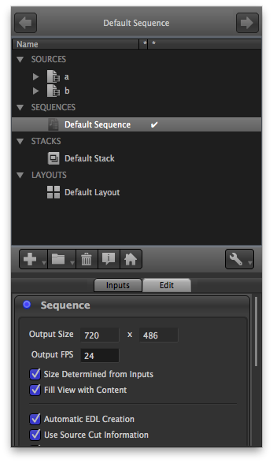
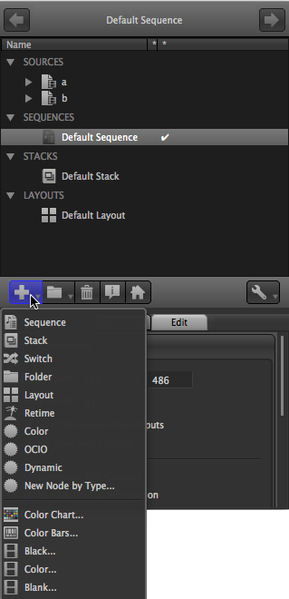
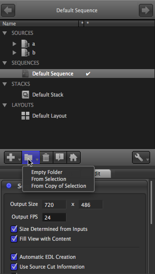
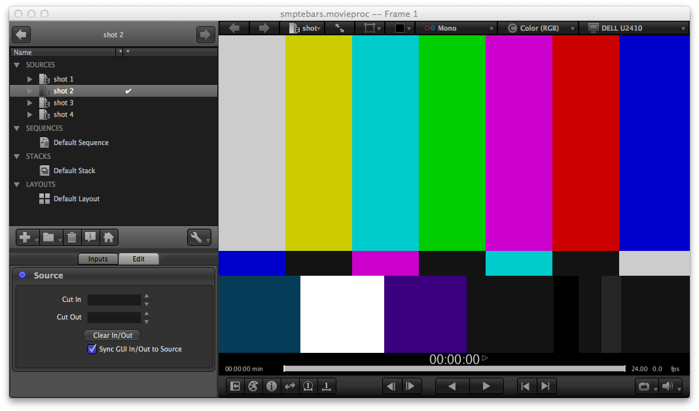
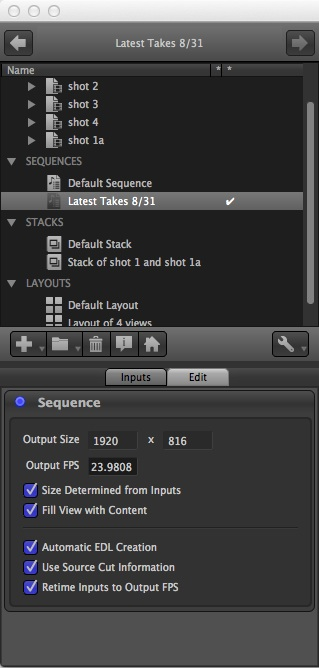
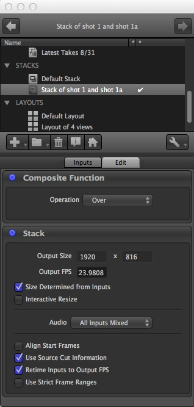
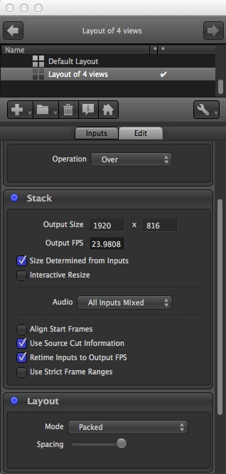
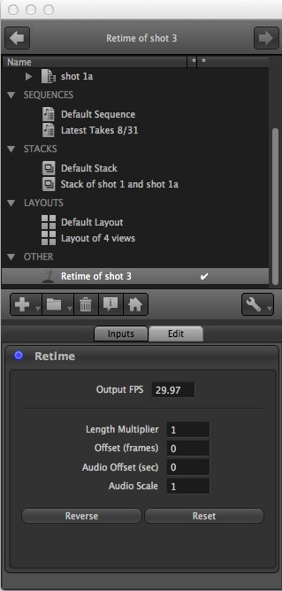
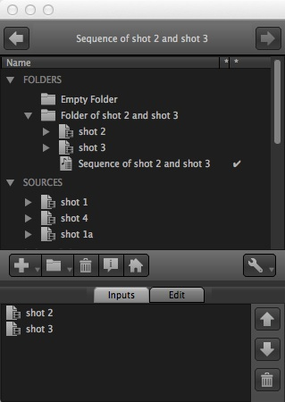

# Chapter 5 - The Session and the Session Manager

### 5.1 Open RV Session

Each viewer window represents an RV session. A session is composed of one or more source movies, frame markers, image transforms, color corrections, and interactive states (like caching and playback speed). The source movies are combined according to the session type. The default RV session type is \`\`sequence,'' which plays back the source movies one after another.

An RV session can be saved as an .rv file. The .rv file contains the entire state of its image processing tree—all of the variables that determine how it will work—as well as information about frame ranges, in/out points, etc. The .rv file stores references to movie files and images; it does not make copies of them. If you change source material on disk and load an .rv file that references those materials, the changes will be evident in RV.

The .rv file is a GTO file. Tools that operate on GTO files can be used on .rv files. C++ and Python source code is available for creating, reading, and manipulating GTO files, including the ASCII GTO files used by RV. [See RV File Format](../rv-reference-manual/rv-reference-manual-chapter-six.md).

### 5.1.1 What's in a Session

A session is represented internally as a Directed Acyclic Graph (DAG) in which images and audio pass from the leaves to the root where they are rendered. Each node in the DAG can have a number of parameters or state variables which control its behavior. RV's user interface is essentially a controller which simply changes these parameters and state variables. An .rv file contains all of the state variables for the nodes in RV's image processing DAG. A description of each of the node types can be found in the Reference Manual.

You can use the gtoinfo program to view the contents of an .rv file from the command line. Other GTO tools like the python module can be used to edit .rv files without using RV itself.

The DAG nodes that are visible in the user interface are called Views. RV provides three default views, and the ability to make views of your own. In addition to any Sources you've loaded, the three views that all sessions have are the Default Sequence, which shows you all your sources in order, the Default Stack, which shows you all your sources stacked on top of one another, and the Default Layout, which has all the sources arranged in a grid (or a column, row, or any other custom layout of your own design). In addition to the default views, you can create any number of Sources, Sequences, Stacks, and Layouts of your own. Whenever a Source is added to the session, it is automatically added to the inputs of each of the default views, not to user-defined views.

### 5.2 Session Manager

   

Figure 5.1: Session Manager on the Mac showing Inputs and Sequence Edit Panel. The DefaultSequence is being viewed.

The session manager is used to examine and edit the contents of an RV session. The session manager shows an outline of the session contents from which you can create, modify, and edit new sequences, stacks, layouts, and more. By default, the Session Manage comes up \`\`docked'' at the left side of the RV window, but it can be un-docked (by clicking and dragging on the title) and positioned as a separate window, or docked at another edge of the RV window.

The session manager interface is in two parts: the top panel shows an outline of the session contents, and the bottom shows either the inputs of the currently viewed object or user interface to edit the current view. By double clicking on an icon in the top portion of the session manager you can switch to another view. By default RV will create a default sequence, stack, and layout which includes all of the sources in the session. When a new source is added, these will be automatically updated to include the new source.

### 5.3 Creating, Adding to, and Removing from a View

   

Figure 5.2:

The Add View and Folders Menus

A new view can be created via the add view menu. The menu is reachable by either the add view (+) button or by right clicking with the mouse in the session outline. Anything selected in the session outline becomes a member (input) of the newly created view. Alternately you can create a view and then add or subtract from it afterwards.

The top items in the view create new views from existing views. The bottom items create new sources which can be used in other views.

Folder views can be created either from the add menu or the folders menu. The folders menu lets you create a folder from existing views or with copies of existing views. When a view is copied in the session manager, the copy is really just a reference to a single object.

You can add to an existing view by first selecting it by double clicking on it, then dragging and dropping items from the session outline into the inputs section of the session manager.

Drag and drop of input items makes it possible to rearrange the ordering of a given view. For example, in a sequence the items are played in the order the appear in the inputs list. By rearranging the items using drag and drop or the up and down arrows in the inputs list you can reorder the sequence.

To remove an item from a view select the item(s) in the inputs list and hit the delete (trash can) button to the right of the inputs list. Similarly, the trashcan button in the upper panel well delete a view from the session. **Please Note** : neither of these remove/delete operations is undoable.

### 5.4 Navigating Between Views

For each RV session, there is always a single \`\`current view'', whose name is displayed at the top of the Session Manager. As in a web browser, RV remembers the history of views you have \`\`visited'' and you can go backwards and forwards in that history.

To change to a different View you can:

*   Double-click on any of the views listed in the top panel of the Session Manager
*   Double-click on any input view of the current view (listed in the Inputs tab of the bottom panel of the Session Manager)
*   Double-click on any visible image in the main RV window
*   Click the left (backwards) and right (forwards) buttons at the top of the Session Manager
*   For backwards compatibility, the items at the top of the Tools menu navigate to the usual default views

Once you have changed views, you can go backwards and forwards in the view history with the arrow buttons at the top of the Session Manager, or with the navigation hot keys \`\`Shift-left-arrow'' (backwards) and \`\`Shift-right-arrow'' (forwards). Note that you can easily navigate between views with out the Session Manager by double-clicking on the image to \`\`drill-down'' and then using \`\`Shift-left-arrow'' to go back.

### 5.5 Source Views

Source Views are the \`\`leaves'' of the graph in that they are views with no inputs (since they get their pixels from some external source, usually files on disk somewhere). The Edit interface for source views is currently used only to adjust editorial information (in the future it may provide access to other per-source information like color corrections, LUTs, etc). In RV, each source has an Cut In/Out information which provide editorial information to views that use that source (like a Sequence view). These In/Out frame numbers can be set from the command line, or changed with the Edit panel of the Source View interface.

  

Figure 5.3:

The Source Edit Interface

By default, \`\`Sync GUI In/Out to Source'' is checked, and you can manipulate the Cut In/Out numbers by setting the in/out frames in the timeline in all the usual ways (see Section [4.5.4](rv-user-manual-chapter-four.md#454-in-and-out-points)). You can also type frame numbers in the given fields, use the up/down nudge keys, or the mouse wheel (after clicking in the relevant field).

### 5.5.1 Source Media Containing Multiple Images (Subcomponents)

In the session manager, a source can be opened revealing the media it is composed of. If the media has multiple layers and/or views (e.g. a stereo OpenEXR file) the media can be further opened to reveal these.

When multiple layers or views (subcomponents) are present in media the session manager will present a radio button interface in one of its columns. Each subcomponent in the media has its own selectable toggle button. When a subcomponent is selected, the source will show only that subcomponent; stereo or any other multiple view effect will be turned off.

You can go back to the default by either double clicking on the media or deselecting the selected subcomponent (toggle it off).

In addition to restricting the media to one of its subcomponents, the session manager also allows you to build new views which include more than one subcomponent. For example if you select all the layers in a multiple layer OpenEXR file, you can create a layout view (right popup menu or the '+' tool button) that shows all of them simultaneously. When RV does this, it creates new temporary sources dedicated to the subcomponent views, layers, or channels that were selected. These subcomponent sources are placed in their own folder.

It's also possible to drag and drop subcomponents into existing view inputs.

### 5.6 Group Views

Folders, Sequence Views, Stack Views, Switch Views, and Layout Views are all \`\`Group Views'' in that they take multiple inputs and combine them in some way for viewing. A Sequence plays it's inputs in order, a Stack layers it's aligned inputs on top of each other, and a Layout arranges it's inputs in a grid, row, column or arbitrary user-determined format.

Some interface is shared by all Group Views:

The Group interface gives you control over the resolution of it's output. During interactive use, RV's resolution invariance means that the aspect ratio is the only important part of the size, but during output with RVIO, this size would be the default output resolution. If Size Determined from Inputs' is checked, the group take it's size from the maximum in each dimension of all it's inputs. If the size is not being programmatically determined, you can specify any size output in the provided fields.

Similarly, the output frame rate can be specified in the Output FPS field. This is the frame rate that is used as the default for any RVIO output of this group, and is also passed to any view for which this group is an input. The output FPS is initialized from the default frame rate of the first input added to the group. If Retime Inputs to Output FPS is checked, inputs whose native frame rate differs from the group's output fps will be retimed so that they play correctly at the output fps. That is, a real-time pull up/down will be performed on the video, and the audio will be resampled to play at the output fps while preserving pitch.

As long as Use Source Cut Information is checked in the Group interface, the group will adopt the editorial cut in/out information provided by the sources (see Section [5.5](#55-source-views) ). This is particularly useful in the case of sequences, but also comes up with stacks and layouts, when, for example, you want to compare a matching region of movies with different overall frame ranges.

    

Table 5.1:

Group View Interfaces: Sequence, Stack, and Layout

#### 5.6.1 Sequence Views

A Sequence view plays back its inputs in the order specified in the Inputs tab of the the Squence interface. The order can be changed by dragging and dropping in the Inputs, or by selecting and using the arrow keys to the right of the list of Inputs. An input can be removed (dropped from the sequence) by selecting the input and then clicking the trashcan button.

In addition to the order of the clips being determined by the order of the inputs, the actual cut in/out points for each clip can also be specified. At the moment, the easiest way to do this is to specify cut information for each source that you want to appear in the sequence with the Source view interface described in Section [5.5](#55-source-views) . As long as Use Source Cut Information is checked in the Sequence interface, the sequence will adopt the editorial cut in/out information provided by the sources.

Since the sequence only shows you one input at a time, if Fill View with Content is checked and the sequence is the current view, the output size of the sequence will be dynamically adjusted so that the \`\`framed'' content always fills the RV window, even if different inputs of the sequence have different aspect ratios.

#### 5.6.2 Stack Views

The Stack View presents it's inputs \`\`on top'' of each other, for comparing or compositing. In this case the order of the inputs determines the stacking order (first input on top). In addition the usual ways of reordering the inputs, you can \`\`cycle'' the stack forwards or backwards with items on the Stack menu, or with hotkeys: ')' and '('.

The compositing operation used to combine the inputs of the stack can be selected in the Edit interface. At the moment, you can choose from Over, Replace, Add, Difference, and Inverted Difference.

Because any or all of the inputs to the Stack may have audio, you can select which you want to hear. Either mix all the audio together (the default), play only the audio from the topmost input in the stack, or pick a particular input by name.

By default, stack inputs will be displayed so that matching \`\`source'' frame numbers are aligned. For example if you stack foo.121-150#.exr on top of goo.56-200#.exr, you'll see frame foo.121.exr on top of goo.121.exr even though the two sequences have completely different frame ranges. If you don't want this behavior and you want the start frames of the inputs to be aligned regardless of their frame numbers, check Align Start Frames.

Also note that the Wipes mode is useful when comparing images in a stack. The use of wipes is explained in Section [4.4.3](rv-user-manual-chapter-four.md#443-comparing-images-with-wipes) .

#### 5.6.3 Layout Views

A Layout is just what it sounds like; the inputs are arranged in a grid, column, row, or arbitrary user-defined pattern. In many ways, a Layout is similar to a stack (it even has a compositing operation for cases where you arrange on input \`\`over'' another). All the interface actions described in Section [5.6.2](#562-stack-views) for Stack Views also apply to Layout Views.

To determine the arrangement of your layout, choose one of five modes. There are three procedural modes, which will rearrange themselves whenever the inputs are changed or reordered: Packed produces a tightly packed or tiled pattern, Row arranges all the inputs in a horizontal row, and Column arranges the inputs in a vertical column. If you want to position your inputs by hand, select the Manual mode. In this mode hovering over a given input image will show you a manipulator that can be used to reposition the image (by clicking and dragging near the center) or scale the image (by clicking and dragging the corners). After you have the inputs arranged to your liking, you may want to switch to the Static mode, which will no longer draw the manipulators, and will leave the images in your designated arrangement.

#### 5.6.4 Switch Views

A Switch is a conceptually simpler than the other group views: it merely switches between its inputs. Only one input is active at a time and both the imagery and audio pass through the switch view. Otherwise, the switch shares the same output characteristics as the other group nodes (resolution, etc).

### 5.7 Retime View

The Retime View takes a single input and alters it's timing, making it faster or slower or offsetting the native frame numbers. For example, to double the length of an input (IE make every frame play twice, which will have the effect of slowing the action without changing the frame rate), set the Length Multiplier to 2. Or to have frame 1 of the input present itself on the output as frame 101, set the Offset to 100.

The Length Multiplier and Offset apply to both the video and audio of the input. If you want to apply an additional scale or offset to just the audio, you can use the Audio Offset and Audio Scale fields.

  

Figure 5.6: Retime View Edit Interface

### 5.8 Folders

Folders are special kind of group view used to manage the contents of the session manager. Unlike other views in RV, when you create a folder its inputs will appear as a hierarchy in the session manager. You can drag and drop and move and copy views in and out of folders to organize them. They can be used as an input just like any other view so they can be nested, placed in a sequence, stack, or layout and can be manipulated in the inputs interface in the same way other views are.

Folders have no display behavior themselves, but they can display their contents as either a switch or a layout.

You can change how a folder is displayed by selecting either Layout or Switch from its option menu.

When a view becomes a member of a folder, it will no longer appear in one of the other categories of the session manager. If a view is removed as a member of a folder, it will once again appear in one of the other categories.

  

Figure 5.7: Folders in the Session Manager

#### 5.8.1 Folders and Drag and Drop

You can drag one or more views into a folder in the session manager to make it a member (input) of the folder. To make a copy of the dragged items hold down the drag copy modified while dragging. On the mac this is the option key, on Windows and Linux use the control key.

The session manager will not allow duplication of folder members (multiple copies of the same view in a folder) although this is not strictly illegal in RV.

Drag and drop can also be used to reorder the folder contents the same way the inputs are reordered. An insertion point will be shown indicating where the item will move to.