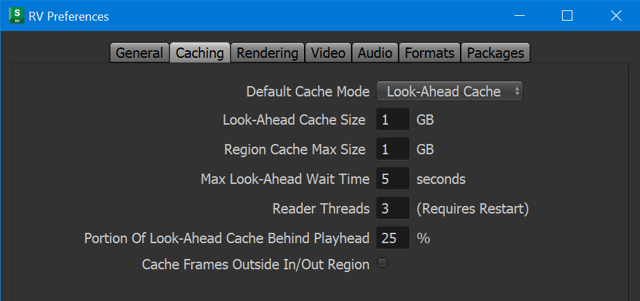

# Chapter 14 - Maximizing Performance

RV has various features intended to make it possible to play back high resolution media from fast I/O devices. If the playback performance is not sufficient and does not meet your needs, you can tune these features to eke out even more frames per second.

There are more than a few variables that determine I/O and decoding speed. When tuning RV you want to start with a simple set of parameters and then adjust one at a time. If you try to adjust all of them at the same time you can't isolate the contribution of each setting and make it much harder to figure out a sweet spot.

Most of these settings are available from either the Caching preference or the Rendering preference panes.

  

Figure 14.1: Render Preference Pane

  

Figure 14.2: Caching Preference Pane

## Internal Software Operations

Some operations occur in software in RV. For example, when you read images in at a reduced resolution, the image has to be resampled in software. When software operations are being performed on incoming images, it's a good idea to use caching. If direct from disk playback performance is important, then these operations should be avoided:

* Image resolution changes
* Pre-Cache LUT
* Color resolution changes (for example, float to 8-bit int color)
* Cropping
* Channel remapping

The use of cropping can either increase or decrease performance depending on the circumstances.

### Streaming I/O Image Formats

Streaming IO works with the following image file formats:

* DPX and Cineon
* JPEG
* TARGA (TGA)
* TIFF
* EXR

## Steps to Improve Performances

When RV is installed, the installer sets the RV preferences to default settings. These settings should allow you to play back correctly most media streams. If this is not the case, you can follow these steps to maximize playback performance.

> Note: To reset RV to default preference, use the `-resetPrefs` command line option.

1. Verify that your workstation meets the recommended system requirements.
1. In RV Preferences > Caching, set **Default Cache Mode** to **Lookahead Cache**. See [Lookahead Cache](#cache-settings) for more details.
1. In RV Preferences > Caching, increase the number of **Reader Threads**. Increase this number by 1 and then test playback. See [**Reader Threads**](#reader-threads) for more details.
1. In RV Preferences > Formats, try alternate **I/O Methods** for the format you're trying to play back. See [**I/O Methods**](#io-methods) for more details.
1. In RV Preferences > Formats, select **Prefetch Images**. This doubles the amount of VRAM required, but significantly increases the amount of bandwidth between RV and the graphics card.
1. On Linux, set up RV to make it run real-time. See [Real-time RV on Linux](#real-time-rv-on-linux) for more details.

If the frames per second performance of RV are fine, but you have issues with tearing, see [Refresh Rate and V-Sync](#refresh-rate-and-v-sync).

To test playback performance, see [Testing Playback Performance](#testing-playback-performances-and-the-filesystem-cache).

### More Optimization Tips

In addition to the more generic optimizations listed before, the following techniques can help you in some specific cases.

* EXR B44 images are ideally subsampled as 4:2:0. Also, keep in mind that B44/A must be 16 bit. PIZ, ZIP, and ZIPS encoded EXR are CPU intensive and may require more EXR decoder threads.
* If you have recent graphics card try setting the DPX and Cineon 10-bit display depth to **10 Bits/Pixel Reversed** in Preferences > Format. This is the fastest and most color preserving method of dealing with 10-bit data in RV. If you have a "30 bit" capable monitor you can also put the X server or Windows in 30-bit mode to get both high precision color and fast streaming this way.
* Displaying 10-bit DPX in 16-bit mode requires 2x the bandwidth from the I/O device AND to the graphics card that 8-bit mode does. If you can use the 10-bit mode for DPX/Cineon try 8-bit first.
* If your I/O device has significant latency, you may need to increase the number of reader threads dramatically to amortize the delay. It some cases it may be beneficial to use more threads than you have cores. This can happen with network storage.
* Make sure RV's v-sync is not on at the same time that the driver's GL v-sync is on. For more information, see [Refresh Rate and V-Sync](#refresh-rate-and-v-sync).
* DPX files which are written so that pixel data starts 4096 bytes into the file, are little-endian, and which use four channel 8 bit, 3 channel 10 bit, or 4 channel 16 bit, and which have a resolution width divisible by 8.
* For speed tests, be sure you're in "Play All Frames" mode (Control menu) as opposed to "Realtime". In this context, "Realtime" means that RV skips video frames to keep pace with the audio.

## System Requirements

While high performance playback cannot be guaranteed, these minimum system requirements should get you reasonable performances.

| Component | Recommended Minimum |
| --- | --- |
| CPU | 64-bit, 6 cores, 12 logical processors |
| Memory (RAM) | 16 GB |
| Memory (GPU) | 8 GB |
| Storage | RAID or nvme |
| Network | 1 Gb/s. |

Since RV aggressively caches its media, the network performance does not directly affect playback performance. It does affect how fast media can be cached, so a faster network allows you to start playback earlier.

## Cache Settings

RV has a three cache settings that you can select: off, cache the current in/out range, or look-ahead buffer. In addition to selecting the cache mode, you can also set the size of the cache for each mode.

The **Look-Ahead Cache** attempts to smooth out playback by pre-caching frames right before they are played. This is the best mode to use when RV can read the files from disk at close to the frame rate, or faster. This is why a fast storage is important as it allows RV to fill the cache faster than it's emptied, ensuring smooth playback. If playback catches up to the look-ahead cache, playback pauses until it fills the cache, or for a length of time specified in the Caching preferences under Max Look-Ahead Wait Time. If RV often pauses playback because it catches up to the look-ahead cache, increase Preferences > Caching > Look-Ahead Cache Size. You can increase this size in increments of 1 GB and see if this solves your issue.

The **Region Cache** reads frames starting at the in point and attempts to fill the cache up to the out point. If there is not enough room in the cache, RV stops caching. This is the mode to use when RV struggles to read files from disk because it tries to cache as much content as possible. This cache works well when playing back media sequentially, but struggles when you jump around in a sequence.

In a review context, the Look-Ahead cache mode is the best solution.

### RAM and Playback

The fastest playback occurs when frames are cached in your computer's RAM. The more RAM you have, the more frames that RV can cache and the more interactive it becomes. By default RV will load images at their full bit depth and size. For example, a 32-bit RGBA tiff will be loaded, cached, and sent to the graphics card at full resolution and bit depth. This gives artists the ability to inspect images with access to the full range of color information and dynamic range, and makes it possible to work with high-dynamic range imagery.

For playback and review of sequences at speed, you may wish to cache images with different settings to fit more frames into the available RAM. You increase the number of frames that will fit in the cache by having RV read the frames with reduced resolution. For example, reducing resolution by half can result in as many as four times the number of frames being cached.

Similarly, reducing the color resolution can squeeze more frames into memory. For example a 1024x1024 4 channel 8-bit integer image requires 4 Mb of memory internally. The same image as 16-bit floating-point requires 8 Mb and a 32-bit float image requires 16 Mb. So by having RV reduce a 32-bit float image to an 8-bit image, you can pack four times the number of frames into memory without changing the image size.

Not caching the Alpha channel of a 4 channel image will also reduce the memory footprint of the frames. You can tell RV to remap the image channels to R, G, B before caching (See [7.3.2](topicid=SG_RV_rv_manuals_rv_user_manual_rv_user_manual_chapter_seven_html#732-channel-remapping)). This may affect playback speed for other reasons, depending on your graphics card. You will need to experiment to determine if this works well on your system.

## Reader Threads

Multiple reader threads are required for fast I/O streaming, and are used when you set **Default Cache Mode** to Look-Ahead Cache or Region Cache. When caching to the region or look-ahead cache, threads are used to read and process the frames. This significantly improves I/O speed for most formats. You set the number of threads from:

* The command line with `-rthreads`
* The preferences under Preferences > Caching > Reader Threads. Any change to the reader count requires restarting RV to take effect.

Each reader thread commandeers a CPU logical processor. When you install RV, the installer sets the number of reader threads to something appropriate for your computer's CPU.

| Number of logical processors | Recommended number of reader threads |
| --- | --- |
| 8 or fewer | 1 |
| 12 | 2 |
| 16 | 3 |
| More than 16 | 4 |

When changing the number of reader threads, always increase in increments of 1, and then test the performance. Only increase the number of threads if necessary. Increasing the thread reader count can make other applications unstable, or render the computer less responsive. If that's the case, decrease the number of threads.

If after increasing the thread reader count performances do not improve, try alternate [I/O Methods](#io-methods) for the formats you're trying to play back.

## I/O Methods

The OpenEXR, DPX, JPEG, Cineon, TARGA, and Tiff file readers all allow you to choose between a few different I/O methods. The best method to use depends on the context RV is being used in and can require some experimentation.

You set the I/O methods for each format in Preferences > Formats.

| I/O Method | Description |
| --- | --- |
| **Standard** | This uses whatever is considered the standard or normal way to read these files. For example with EXR this uses the "normal" EXR I/O streams that come as part of the EXR libraries. Not available to all formats. |
| **Buffered** | The data is "streamed" as a single logical read of all data. The file data is allowed to reside in the filesystem cache if the kernel decides to do so. The file data is decoded after all the data is read. |
| **Unbuffered** | Similar to **buffered**, except that RV provides a hint to the kernel that file data should not be put into the filesystem cache. In theory this could lead to faster I/O because a copy of the data is not created during reading. In practice, this has never been observed in the field. |
| **Memory Mapped** | The file contents are mapped directly to main memory. This has the advantage that it may not be filesystem cached and the memory is easily reclaimed by the process when no longer needed. In some respects it is similar to the **buffered** method. |
| **Asynchronous Buffered** | Similar to **buffered** but the kernel may provide the data to RV in some random order instead of waiting to assemble the data in order itself. In addition the low-level I/O chunk size can be used to tune the I/O to maximize bandwidth. |
| **Asynchronous Unbuffered** | Same as Asynchronous buffered, but a hint is provided to the kernel to omit storing the data in the filesystem cache if possible. |

Note: Not all I/O methods are supported by all file systems. In particular, the **Unbuffered** I/O method may not be supported by the underlying file system implementation.

Typically, the circumstance in which RV is used dictates which method is optimal.

When using multiple reader threads, asynchronous methods may not scale as well as the synchronous ones.

You can also select the method from the command line. The command line options -exrIOMethod, -dpxIOMethod, -jpegIOMethod, -cinIOMethod, -tgaIOMethod, and -tiffIOMethod are detailed in [Chapter 3 - Command Line Usage](./rv-user-manual-chapter-three.md).

### Setting EXR Decoding Threads

OpenEXR decoding benefits from more cores. B44 2k full-aperture 4:2:0 sampled files are approximately 4 Mb in size so they don't require as much bandwidth as DPX files of the same resolution. For 4:4:4 sampled or B44A with an alpha channel more bandwidth and cores may be required. Generally speaking you should have about as much bandwidth as similar DPX playback would require.

When decoding EXR files, you have the option of setting both the number of reader threads in RV and the number of decoder threads used by the EXR libraries. The exact numbers depend on the flavor of B44/A files being decoded.

If you want to stream EXR files you may want to reserve some of your cores for decoding. The number of EXR decoding threads can be changed from the Preferences > Formats > OpenEXR. Always check performances with **Automatic Threads** activated.

If this doesn't work, deselect **Automatic Threads** and increase the number in Reader/Decoder Threads by 1. Check performances, and increase by thread count by 1. Repeat until performances are acceptable, but don't go over the number of logical cores of your workstation minus 1 (if you have 16 logical cores, don't go over 15) or your system will become unstable. If performances are still degraded, you need to look elsewhere, such as upgrading your hardware.

### About File I/O and Decoding Latency

When reading frames directly from disk, file I/O is often a huge bottleneck. If your frames live across a network connection (such as an NFS mount) the latency can be even greater. Ideally, if RV is playing frames without caching, those frames would be on a local disk drive, RAID, or SAN sitting on a fast bus.

Part of the I/O process is decoding compressed image formats. If the decoding is compute intensive, the time spent decoding may become a bottleneck. If good playback performance off disk is a requirement, choose a format that does not require extensive decoding (Cineon or DPX), or one that can be parallelized (EXR).

As always, there is a tradeoff between file size and decoding time. If you have a slow network, you might get better performance by using a format with complex expensive compression. If your computer is connected to a local high-speed RAID array or an SSD, then storing files that are easy to decompress but have larger file size may be better.

## Real-Time RV on Linux

On Linux, you can tell RV to run as a real-time application. This mode enables the most stable possible playback on Linux, especially if the machine as been set up with server time slice durations (which is often the case when the machine is tuned for maximum throughput). Ideally, RV runs with **more and smaller** time slices -- at least for display and audio threads.

To start RV in this mode use:

```bash
rv -scheduler SCHED_RR -priorities 99 99
```

RV Linux will try to use either the FIFO or Round Robin scheduler in place of the normal Linux scheduler in this case. To do so, it must have the capability CAP_SYS_NICE. This can be achieved in several ways, including: running `setuid` root on the Linux binary so it has root privileges, or just running RV as root.

On macOS, RV is a real-time application by default and does not require any special privileges.

On Windows, RV elevates its priorities as high as possible without admin privileges.

> Note: When RV runs with higher priorities, this is referring to only two of its threads: the display thread and the audio thread. Neither of these threads do much computational work. They are both usually blocked. So you shouldn't need to worry about RV consuming too many kernel resources.

## Refresh Rate and V-Sync

The biggest hurdle to smooth playback is to recognize the effects of playback FPS coupled with the monitor refresh rate. For example, it’s typically the case that an LCD monitor will have a refresh rate of ~60 Hz by default (that is, it refreshes 60 times a second). Playing 24 FPS material on a 60Hz monitor will result in something similar to a 3/2 pull-down. To get smoothest playback, the ideal refresh rate would be 48 Hz or 72 Hz or some other multiple of 24. Also, a "60 Hz" monitor may actually be 59.88 Hz which means that even 30 FPS material will not play back perfectly smoothly. You need 59.88 / 2 (29.94) FPS for best results.

### Multi-monitor Systems

Systems with multiple attached monitors have another problem: the monitor that RV is playing on may not be the monitor that it’s syncing to. If that happens the play back can become irregular. On Linux for example, the driver can only sync to one monitor -- it can't change the sync monitor once RV has started. On Linux you can change which monitor the driver uses for sync by setting the environment variable **__GL_SYNC_DISPLAY_DEVICE.** Here's a relevant passage from Nvidia's driver README:

> When using __GL_SYNC_TO_VBLANK with TwinView, OpenGL can only sync to one of the display devices; this may cause tearing corruption on the display device to which OpenGL is not syncing. You can use the environment variable __GL_SYNC_DISPLAY_DEVICE to specify to which display device OpenGL should sync. Set this environment variable to the name of a display device; for example "CRT-1". Look for the line "Connected displaydevice(s):" in your X log file for a list of the display devices present and their names. You may also find it useful to review [Chapter 10, *Configuring TwinView*](http://ru.download.nvidia.com/freebsd/180.44/README/chapter-10.html) "Configuring Twinview," and the section on Ensuring Identical Mode Timings in [Chapter 16, *Programming Modes*](http://ru.download.nvidia.com/freebsd/180.44/README/chapter-16.html).

### V-Sync versus driver V-Sync

When playing 24 frames/second (24Hz) media on a monitor with a refresh rate of 60Hz (60 frames per second) you can only emulate the timing of frames being played on a 24Hz movie projector. It’s not possible to literally get the same timing. The reason is simple math: you can’t evenly divide 60 by 24.

RV tries to get around this issue by playing back at as close to the device rate as possible (in this case 60 Hz) and by trying to spread out 24 frames over the 60 actual frames in a visually pleasing way. If you were to look at the timing of the frames you would see that some frames are played back 3 times in a row and others only 2.

The only way around this problem is to match the output device rate to the media rate in such a way that the device rate is evenly divisible by the media rate.

Do not run RV with both the driver's GL v-sync on and RV's. This will almost guarantee bad playback. Use one or the other. Experiment to see if one results in better timing than the other on your system. These settings are:

* In RV: Preferences > Rendering > Video Sync
* In nvidia-settings: openGL > Sync to VBlank

NVIDIA recommends using the driver v-sync and disabling RV's v-sync if possible. On Linux, RV tries to detect which monitor the driver is using for sync and warn you if it’s not the one RV is playing on (it outputs an INFO message in the shell or console window). In presentation mode, RV shows a message box if the presentation device is not the sync device on Linux.

## Testing Playback Performances and the Filesystem Cache

All operating systems (that RV runs on) try to maximize IO throughput by holding some pages from the filesystem in memory. The algorithms can be hard to predict, but the upshot is that if you're trying to test real-time streaming IO performance this "assistance" from the OS can invalidate your numbers; to be clear, for testing, you want to ensure that you start each run with **none** of the sequence to be played in memory. One way to do this is with a very large test set. Say several sequences, each several thousands of frames. If the frames are big enough and you RAM is small enough, then switching to new sequence for each testing run will ensure that no part of the new sequence is already in the filesystem cache.

But a more certain way to ensure that none of your frames are in the memory, which also lets you use the same sequence over and over for testing, is to forcibly clear the filesystem cache before each testing run.

On Linux you can run this command:

```bash
sudo echo 1 > /proc/sys/vm/drop_caches
```

On macOS, use the command `purge` on the command line to achieve the same result.
