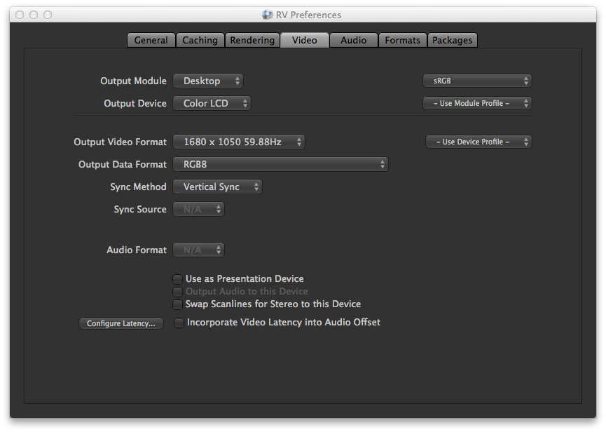
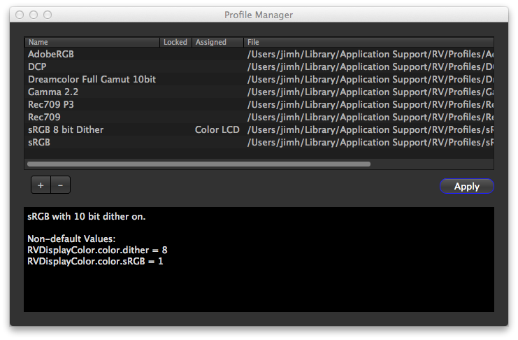
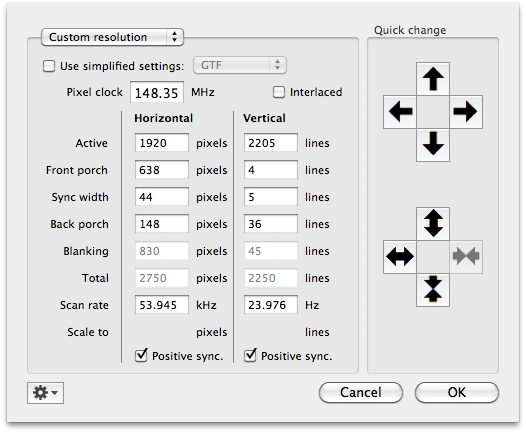
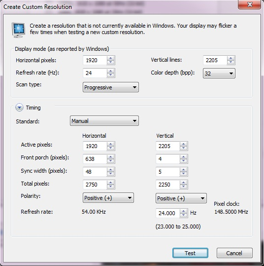

# Chapter 6 - Presentation Mode and Video Devices

RV has a facility called presentation mode for use with machines with multiple attached display devices like projectors, second DVI/DisplayPort monitors or HDMI compatible stereo televisions.

Presentation mode turns the main RV user interface into a control interface with output going to both it and a second video device. The secondary video device is always full screen. The primary use for presentation mode is multiple people viewing a session together.

Typically a video device is set up once in the preferences and used repeatedly. Presentation mode can be turned on from the View → Presentation Mode menu item. It's also possible to pass command line arguments to RV to configure and start presentation mode automatically when it launches.

### 6.1 Video Device Configuration

Video devices are configured from the preferences Video tab. The interface is in two parts: the module/device selection and the video configuration parameters. For each module/device combination there is a unique set of configuration parameters.

Different devices will have different configuration parameters and some devices may not use all of the available ones.

  

Figure 6.1:

Video Preferences

Output Module

A video output module can contain multiple devices. All of the devices in a module will have the choices for configuration parameters. For example, on a system with multiple monitors there will be a Desktop output module with a device for each connected monitor. In the video preferences window, you can also specify a default display profile for the module.

Output Device

The output devices are either numbered or named depending the module. The Desktop module uses the actual monitor name and manufacturer to identify them. In the video preferences you can specify a default display profile for the specific device or indicate that the device should use the default module profile.

Output Video Format

Video formats typically include a resolution and frequency. If the video format is not changeable by the user this field will display the output resolution of the device. In the video preferences a specific profile for the selected video and data format can be assigned.

Output Data Format

The data format indicates how the the pixels are to be presented to the device. This can include the numerical precision as well as color space (e.g. RGB or YCbCr). For devices that support stereo this is usually where stereo options are found. To use HDMI 1.4a stereo modes like Side-by-Side or Top-and-Bottom, you select the appropriate Data Format here. **PLEASE NOTE** : if you use a stereo data format here, then the Stereo mode on RV's View menu should be set to “Off”.

Sync Method

If the device as multiple options for synchronization these will be selectable under the sync method. For example, desktop devices typically have vertical sync on/off as an option.

Sync Source

If the synchronization can come from an external device it can be configured here. This option will usually change depending on the sync method.

Use as Presentation Device

If this is checked, the device will be used by presentation mode. Only one device can be selected as the presentation device.

Output Audio to this Device

If checked, audio will be routed to the device if it has audio capabilities.

Incorporate Video Latency into Audio Offset

If checked, the total latency as indicated in the Configure Latency dialog box will be applied to the audio offset – but only if audio is being played by the controller instead of the output device (i.e. Output Audio to this Device is not checked). This is primarily useful if the video device has a large buffer causing a significant delay between the controller's audio output and the video output.

### 6.2 Display Profiles

Each video device configuration can have a unique display profile associated with it or can be made to use a default device or module profile. Profiles can be created and managed via View → Create/Edit Display Profiles.... Profiles are searched for in the RV_SUPPORT_PATH in the Profiles subdirectory (folder).

Display profiles are snapshots of the view settings including a display LUT if present, the transfer function (sRGB, Rec.709, Gamma 2.2, etc), the primaries, the background, view channel ordering, stereo view modes, and dithering. If a custom nodes have been defined and are used in the display color pipeline than those will also be stored in the display profile.

  

Figure 6.2:

Display Profile Manager

The display profile manager can be started from the view menu. This is where profiles can be created and deleted.

When a profile is created, the values for the profile are taken from the current display device or you can select another device at creation time. Most of the view settings for the current device are present under the View menu

1

Custom or alternate nodes inserted into the RVDisplayPipelineGroup and their property values will also be stored in the profile if they are present. This makes it possible to use custom shaders, multiple display LUTs, or OpenColorIO nodes and have them be saved in the profile.

. Newly created profiles are always written to the user's local Profile area. To share a profile with other user's, the profile file can be moved to a common RV_SUPPORT_PATH location.

If a profile is already assigned to a device, the device name will appear next to the profile in the manager.

By selecting a profile and activating the Apply button, you can set the profile on the current view device. Applying a profile does not cause it to be remembered between sessions. In order to permanently assign a profile use the Video tab in the preferences.

### 6.3 Video Device Command Line Arguments

There are five arguments which control how presentation mode starts up from the command line:

| | |
| ----------------------------- | --------------------------------------------------------------------------------------------------------------------------------------------------------------------------------------------------------------------------------------------------------------------------------------- |
| -present                     | Causes the program to start up in presentation mode                                                                                                                                                                                                                                     |
| -presentAudio [0 or 1]     | Enables audio output to the presentation device if 1 or turns off if 0                                                                                                                                                                                                                   |
| -presentDevice MODULE/DEVICE | Forces the use of DEVICE from MODULE. Note that the forward slash character must separate the device and module names.                                                                                                                                                                  |
| -presentVideoFormat format   | Forces the use of format for the video format. The format is a string or substring of full description of the video format as the appear in the video module in the preferences. For example: “1080p” would match “1080p 24Hz”. The first match is used.                                |
| -presentDataFormat format    | Forces the use of format for the data format. Like the video format above, the data format string is matched against the full description of the data formats as they appear in the video module in the preferences. For example: “Stereo” would match “Dual Stereo YCrCb 4:2:2”.|

Table 6.1:

Presentation Mode Command Line Arguments

The command line arguments will override any existing preferences.

### 6.4 Presentation Mode Settings

When the controller display mode is set to Separate Output and Control Rendering you can choose which elements of the user interface are visible on the presentation device. These can be turned on/off via the View → Presentation Settings menu. This includes not only things like the timeline and image info widget, but also whether or not the pointer location should be visible or not. In addition, you can show the actual video settings as an overlay on the display itself in order to verify the format is as expected. You can also control the display of feedback messages and remote sync pointers with items on this menu. The settings are retained in the preferences.

If you want your custom-build widget to be rendered on the Presentation Device, your widget just needs to set the Widget class data member _drawOnPresentation to true.

### 6.5 Platform Specific Considerations

#### 6.5.1 Linux Desktop Video Module Issues

These issues apply only when using the desktop video module.

The current state of the X server XRANDR extension and client library prevents us from implementing automatic resolution switching from RV. If your distribution has the xrandr binary available and installed, you can manually use that to force the presentation monitor into the proper resolution.

When presentation mode starts up, RV will put the control window into a mode that allows tearing of the image in order to ensure that the presentation window will not tear. Be aware that the control window is no longer synced to a monitor.

##### nVidia Driver

RV will warn you if your presentation device is set to a monitor that the nVidia driver is not using for vertical sync. In that case you can continue, but tearing will probably occur if the attached monitors are not using identical timings. You can set the monitor which the driver syncs to using the __GL_SYNC_DISPLAY_DEVICE environment variable as per nVidia's driver documentation. See the nvidia-settings program to figure out the proper names (e.g. DPF-1 or CRT-1).

nVidia recommends setting the driver V-Sync on and turning RV's V-Sync off if possible. If not, RV will attempt to sync using the appropriate GL extension. You can turn on/off RV's V-Sync via the checkbox under Preferences → Rendering.

#### 6.5.2 Mac Desktop Video Module Issues

On macOS it's not a known fact, but it appears that vertical sync is timed to the primary monitor. This is the monitor on which the menu bar appears. You can change this via the system display settings Arrangement tab.

Ideally, the presentation device will be on the primary monitor.

RV will configure the controller display to prevent interfering with the playback of the presentation monitor. The control device may exhibit tearing or other artifacts during playback. On some versions of macOS, once the controller has entered this mode, it cannot be switched back even after presentation mode has been exited.

#### 6.5.3 Windows 7 Video Module Issues

On Windows, like macOS, the vertical sync is somewhat of an unknown. However, it appears that like macOS, the primary monitor (the one with the start menu) is the monitor the sync is derived from. So ideally, use the primary monitor as the presentation device, but your milage may vary.

### 6.6 HDMI Frame Packed Mode

Stereoscopic media can be displayed in Frame Packed (or “Frame Packing”) mode on any HDMI 1.4a-compliant device (AKA 3DTV). But in order for RV to make use of this display resolution (which is roughly a double-height HD frame), the monitor or other display device must have the appropriate resolution defined in advance. The timings from the HDMI 1.4a specification are shown in the following table:

| | | | |
| ----------------- | -------------- | -------------- | ------------ |
|                   |                | **Horizontal** | **Vertical** |
| **Active pixels** | **1080p 24Hz** | 1920           | 2205         |
|                   | **720p 60Hz**  | 1280           | 1470         |
| **Front porch**   | **1080p 24Hz** | 638            | 4            |
|                   | **720p 60Hz**  | 110            | 5            |
| **Sync width**    | **1080p 24Hz** | 48             | 5            |
|                   | **720p 60Hz**  | 40             | 5            |
| **Back porch**    | **1080p 24Hz** | 144            | 36           |
|                   | **720p 60Hz**  | 220            | 20           |

Table 6.2:

HDMI 1.4a Frame Packed Video Timings

An additional important number is the required “pixel clock” or “pixel frequency”, which should be 148.5 MHz (for either 1080p or 720p),.

#### Linux

Sample Xorg.conf lines for 1080p 24Hz (720p 60Hz commented out), using the timings from the table above:

```
Section "Monitor"
...
Modeline  "1920x2205_24" 148.32 1920 2558 2602 2750 2205 2209 2214 2250 +hsync +vsync
#Modeline "1280x1470_60" 148.5  1280 1390 1430 1650 1470 1475 1480 1500 +hsync +vsync
...
EndSection
Section "Device"
...
Option "ModeValidation" "NoDFPNativeResolutionCheck"
Option "ExactModeTimingsDVI" "True"
...
EndSection
Section "Screen"
...
Option "metamodes" "DFP-0: 1920x1080_60 +0+0, DFP-2: 1920x2205_24 +1920+0"
...
EndSection
```

#### Mac

On OSX, we have used the shareware utility SwitchResX to add a Frame Packed resolution. Once the 1920x2205 resolution is visible in the Display preferences, it will show up in the Output Video Format selector on the Video Preference for the appropriate output device. If this device is selected as the presentation device, the monitor will go in and out of this mode when presentation mode is turned on and off.

It's possible that there are various limitations to this approach. Our testing was on a MacBook Pro with Nvidia GFX (9600M GT), and we have reports of this working on a MacPro with Nvidia GFX (Quadro 4000) and a MacPro with ATI GFX (Radeon HD 5770), although the latter required some adjustments. Also, we have no reports of this working on OSX 10.7 yet. In one case, we haven't been able to make this work with a MacBookPro running 10.7 with ATI GFX. So, bottom line is that it can be made to work in some cases, but we can't guarantee it.

Here's a screengrab of the SwitchResX custom resolution dialog, showing our 1920x2205 mode:

  

#### Windows

On Windows, you can use the NVIDIA control panel to create a custom resolution with the above timings. Go to “Change Resolution”, then “Custimize”, then “Create Custom Resolution”, then “Timing”, for the “Standard”, choose “Manual” and input the timings described above. Please note that RV cannot put the monitor in this Custom Resolution (the windows API does not expose the custom resolutions), so you need to choose the custom mode yourself (in the NVIDIA control panel, “Change Resolution” section) before you start RV. When RV starts, it will add the current (custom) mode to the Video Formats list in the Video Preferences tab, and you can select it there, then select the “Frame Packed” Data Format.

Here's an example the timing setup that has worked for us:

  
