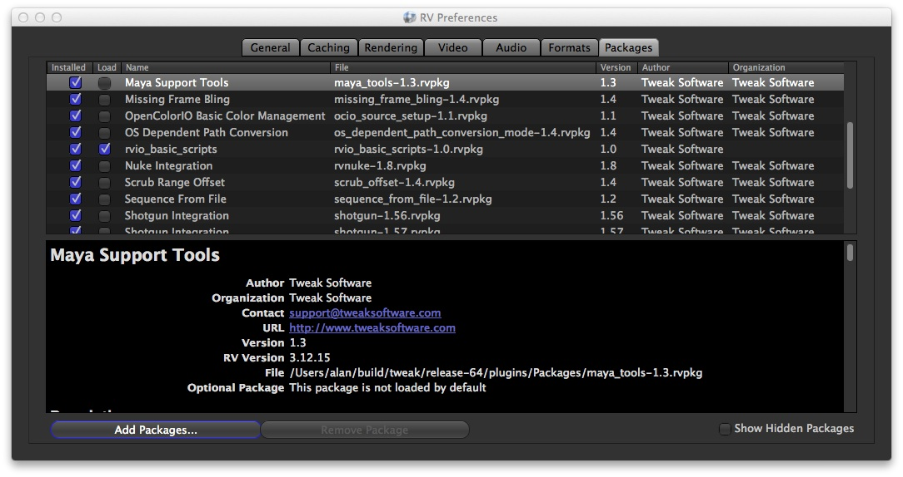

# Chapter 10 - Packages

There are multiple ways to customize and extend RV, and almost all these ways can be encapsulated in an RV Package. A package is a zip file with source or binary code that extends RV's feature set. Packages are constructed so that they can be automatically installed and removed. This makes it much easier for you to maintain RV than if you modify RV source directly. (Note: although packages are zip files, they are labeled with a .rvpkg extension to prevent mail programs, etc, from automatically unzipping them.)

Packages can encapsulate a wide variety of features: everything from setting the titile of the window automatically to implementing a paint annotation package. Some of RV's internal code is also in package form prior to shipping: e.g. the entire remote sync feature is initially constructed as a package of Mu source code (but is permanently installed when shipped).

The package manager can be found in the preferences dialog. There are two sections to the user interface: the list of packages available and the description of the selected package. Some packages may be “hidden” by default; to see those packages toggle the show hidden packages button. To add and remove packages use the add and remove buttons located at the bottom left.

The reference manual contains detailed information about how to create a package.

### 10.1 Package Support Path

When a package is added, a list of permissible directories in the support path is presented. At that time you can choose which support directory to add the package to. When RV starts, these directories are automatically added to various paths (like image I/O plugins).

By default, RV will include the application directory's plug-ins directory (which is probably not writable by the user) and one of the following which is usually writable by the user:

| | |
| -------------------------------- | -------- |
| ~/Library/Application Support/RV | macOS |
| ~/.rv                            | Linux    |
| $APPDATA/RV                      | Windows  |

You can override the default support path locations by setting the environment variable RV_SUPPORT_PATH. The variable contents should be the usual colon (Linux and Mac) or semicolon (Windows) separated list of directories. The user support directory is not included by default if you set the RV_SUPPORT_PATH variable, so be sure to explicitly include it if you want RV to include that path. Also note that the support path elements will have subdirectories called Mu, Packages, etc. In particular, when using the support path to install Packages, you want to include the directory above Packages in the path, not the Packages subdir itself.

The file system of each directory in the support path contains these directories:

| | |
| ---------------- | ----------------------------------------------------------------------- |
| Packages/        | Package zip files                                                       |
| ConfigFiles/     | Area used by packages to store non-preference configuration information |
| ImageFormats/    | Image format Plug-Ins                                                   |
| MovieFormats/    | Movie format Plug-Ins                                                   |
| Mu/              | Mu files implementing packages                                          |
| Output/          | Output Plug-Ins (Audio/Video)                                           |
| MediaLibrary/    | Media Library Plug-Ins                                                  |
| Python/          | Python files implementing packages                                      |
| SupportFiles/    | Additional files used by packages (icons, etc)                          |
| lib/             | Shared libraries required by packages                                   |

RV will create this structure if it's not already there the first time you add or install a package.

### 10.2 Installation

To add a package:

1. Open the Package Manager.
1. In the Packages tab, click **Add Packages...**
1. Navigate to the package's .rvpkg file.

  

Figure 10.1: Package Manager

Tip: When you are troubleshooting packages you have installed, enable the **Show Hidden Packages** checkbox.

Once a package has been added, to install or uninstall simply click on the check box next to the name. The package is installed in the same support directory in which it was added.

A package can be added, removed, installed, and uninstalled for all users or by a single user. Usually administrator privileges are necessary to operate on packages system wide. When a package is added (the rvpkg file) it is copied into a known location in the support path.

It's best to avoid editing files in these locations because RV tries to manage them itself. When a package is installed the contents will be installed in directories of the support directory.

When first installed, packages are loaded by default. To prevent a package from loading uncheck the load check box. This is useful for installed packages which are not uninstallable because of permissions. While the install status of a package is universal to everyone that can see it, the load status is per-user.

**Note** : A restart of RV is before a change in a package Installed or Loaded state takes effect.

### 10.3 Package Dependencies

Packages may be dependent on other packages. If you select a package to be installed but it requires that other packages be installed as well, RV will ask you if it can install them immediately. A similar situation can occur when setting the load flag for a package. When uninstalling/unloading the opposite can happen: a package may be required by another that is “using” it. In that case RV will ask to uninstall/unload the dependent packages as well.

Some packages may require a minimum version of RV. If a package requires a newer version, RV shouldn't allow you to install it.

In some cases, manual editing of the support directory may lead to a partially installed or uninstalled package. The package manager has a limited ability to recover from that situation and will ask for guidance.