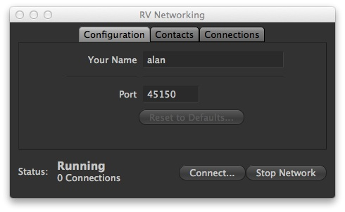
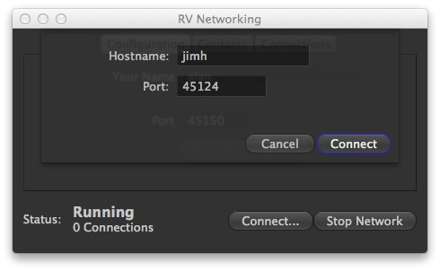
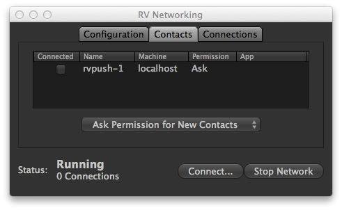
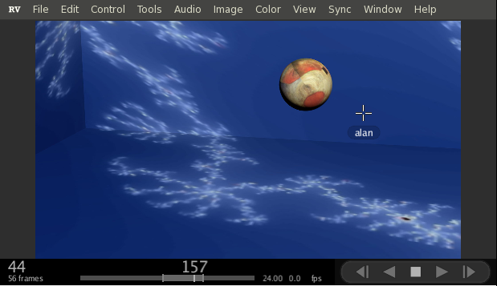
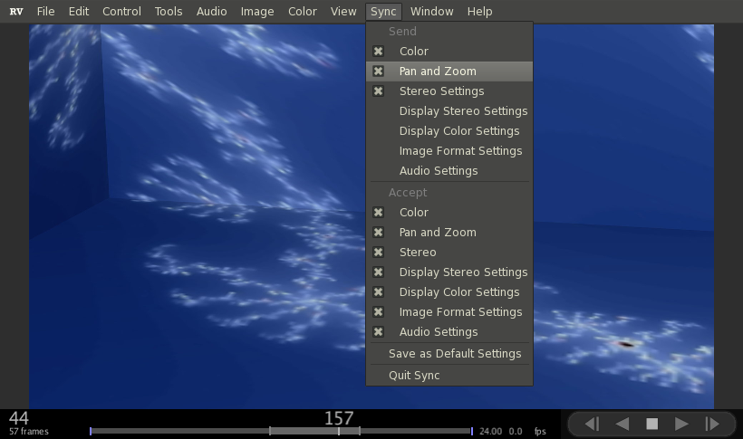

# Chapter 13 - Networking

RV implements a simple chat-like network protocol over TCP/IP. Network connections can be between two RVs or between a custom program and RV. The protocol is documented in the reference manual. This chapter discusses how to make network connections, how network permissions work, and how to synchronize two RVs using networking.

Note that just turning on networking and establishing a connection doesn't actually do anything in RV. But this step is necessary before any of the features that use the networking can start.

Some of the things you can do with networking include synchronizing to RV sessions across a network, sending pixels from another program to RV (e.g., a RenderMan display driver), or controlling RV from another program (remote control). Sync is part of RV, but remote control and sending pixels must be implemented in another program. RV comes with source code to a program called rvshell which shows you how to write software that connects with RV and controls playback remotely as well as sending images to RV over the connection. Some other applications are using special devices to control RV (like apple remote control for example) or controlling RV as an embedded playback component in a custom application on Linux.

The reference manual has documentation about the networking protocol and how to create programs that talk to RV. The inner workings of the rvshell program are also discussed there.

While it's possible to create connections across the internet, it's a little tricky, see [13.1.4](#1314-networking-across-the-internet) .

**Warning:** Care should be taken with RV networking. Once a connection is established to a client application (RV or any other client) all scripting commands (including "system(...)") are allowed and executed with the user id and permissions of the local RV user. Local connections (from a client application running on the same machine as RV), are not authenticated and the user is not required to confirm connection. Remote connections must be explicitly allowed by the user, but the identity of the remote user can not be confirmed. Also note that traffic over RV network connections is generally not encrypted.

Use of RV Remote Sync is at your own risk. Although we may recommend preferred configurations, we cannot guarantee that any configuration will be secure or that your use of RV Remote Sync will not introduce vulnerabilities into your systems. If you do not wish to accept this risk, please do not use RV Remote Sync.

## 13.1 The Network Dialog

Before you can use any of RV's networking features, you have to tell RV to begin listening for connections. There are two ways to do this: from the command line using the -network flag or interactively using the the Network dialog via the RV → Networking... menu item.

The network dialog box has three pages: Configuration for setting up your identity and the port on which RV will communicate, the Contacts page for managing permissions, and the Connections page which shows a list of the currently active connections. At the bottom of the dialog are buttons for starting and stopping the networking and for initiating a new connection.

  

Figure 13.1: RV Network Dialog

### 13.1.1 Configuration

The configuration requires two pieces of information: your identity (which appears at the other end of the connection) and a port number. Unless your systems administrator requires RV to use a different port you should leave the default value for the port number. Networking must be stopped in order to change the configuration.

### 13.1.2 Starting a Connection

To start networking and have RV accept connection just hit the Start Network button. Once running, the status indicator in the bottom left-hand corner of the dialog will show you the network status and the number of active connections (which starts out as 0).

There are two ways to initiate a new connection: by pressing the Connect... button at the bottom of the dialog or by selecting a known address on the Contacts page.

Using the Connect... button will show another dialog asking for the host name of the machine to connect to. Using this method, RV will not care which user it finds at the other end of the connection. If RV does not yet have record of the user it finds it will create one.

  

Figure 13.2: Network Dialog Starting a Connection

### 13.1.3 Contacts and Permissions

If networking is on, and a connection is initiated by another party, RV will ask whether or not you want the connection to occur. At that point you have three choices: accept the connection but ask for permission next time, always accept connection from the user/program that's asking, or deny the connection.

Each new contact that RV receives (whether or not you accept) is recorded in the Contacts page. On this page you delete existing contacts, change permissions for contacts, and initiate connections to contacts. You can also specify the behavior RV when new contacts try to connect to your RV. This is most useful when RV is used by multiple people (for example in a common space like a view station). Often instances of RV running in common spaces should be more conservative about allowing connections without asking.

To change an existing contacts permissions, double click on the current value (where it says, Allow, Ask, or Reject). You should see a pop-up menu which lets you change the value.

To initiate a connection to an existing contact, double click on the contact name or machine name.

There is also a pop-up menu which lets you delete an existing contact or initiate a connection.

  

Figure 13.3: Network Contacts Page

### 13.1.4 Networking Across the Internet

It's possible to connect to a remote RV across the internet in a peer-to-peer fashion, but special care needs to be taken. We recommend one of two methods: using ssh tunneling or using a VPN.

SSH tunnelling is well known in the IT community. Since there is no standard firewall configuration, you will need to understand both the way in which ssh tunnelling is set up and the topology of the firewalls on both ends of the connection. No third party connection is needed to sync across ssh tunnels and the connection is relatively secure.

Using a VPN is no different than a local area network once it has been established: you need to know the IP address or name of the host with which you want to connect. If you do not have a VPN in common with the remote participant, you can create one using [Hamachi](https://secure.logmein.com/products/hamachi/vpn.asp) . The service is free for non-commercial use. See their website for more details.

## 13.2 Synchronizing Multiple RVs

Once a connection has been established between two RVs, you can synchronize them.

To start sync select the menu item Tools → Sync With Connected RVs. You should see \`\`Sync ON'' in the feedback area on both RVs and a Sync menu will appear in the menu bar.

Usually it's a good idea to have all participants looking at the similar media, but it's not enforced. In particular, note that RV's auto-conforming features mean that one party can be looking at a high-res OpenEXR sequence and another at a qucktime movie of the same sequence, and the sync can still be quite useful.

  

Figure 13.4: Sync Mode Showing Remote User's Cursor

### 13.2.1 Using Sync

You can control which aspects of RV are transmitted to and received from remote RV's from the Sync menu. The menu is divided into to two main sections: things you can send and things you have agreed to receive. By default, sync mode will accept anything it gets, but will only send certain types of operations. So if one of the participants decides to send more than the default state the remote RVs will automatically use it.

Sync mode will always send frame changes and playback options like the current fps, and the playback mode.

  

Figure 13.5: Sync Mode Menu

| Event Group             | What Gets Sync'ed                                                                                                                                                                                                                 |
| ----------------------- | --------------------------------------------------------------------------------------------------------------------------------------------------------------------------------------------------------------------------------- |
| Color                   | Any per-source color changes. E.g., exposure, gamma, hue, saturation and contrast. The File LUT is currently not synced between RVs.                                                                                              |
| Pan and Zoom            | Any viewing pan and zoom changes. The scales are relative to the window geometry (which is not synced).                                                                                                                           |
| Stereo Settings         | Settings that are per-source (e.g., those that are found under the Image → Stereo menu). Stereo settings from the under View → Stereo menu are not included.                                                                      |
| Display Stereo Settings | Stereo settings that affect the entire session (e.g. those found under the View → Stereo menu). This includes the stereo display mode. Be careful when using this when any participant is not capable of hardware stereo viewing. |
| Display Color Settings  | Overall brightness, red, green, blue, channel isolation, display gamma, display sRGB and Rec709 modes. Most of the items found under the View menu. The look and display LUTs are currently not synced.                           |
| Image Format Settings   | Image resolution, color resolution, rotation, alpha type, pixel aspect ratio changes.                                                                                                                                             |
| Audio Settings          | Soundtrack and per-source audio volume, balance, cross-over, etc. Things found under the Audio menu.                                                                                                                              |
| Default                 | Frame changes, FPS, realtime and play all frames playback mode settings, in and out points. These are always sync'ed.                                                                                                             |

Table 13.1: Sync Mode Sending and Receiving Events

## 13.3 “Streaming” Movie Media from Online Sources

Media “paths” provided to RV may be URLs that link to online media. These may be provided via the command line, in RVSession Files, or through scripting. This functionality should be considered “Beta” and there are several caveats you should be aware of:

* The “media from online” workflow is a worst-case for RV's caching system, which generally assumes that the media can be accessed at arbitrary locations. In general, it's probably best to use Region Caching, with a large cache size, and allow the media to cache before playback begins. For media that is low-bandwidth, or for particularly low-latency connections, it may work well to use a large Lookahead Cache.
* The URL needs to end in “.mov” or “.mp4” or some other extension that the MIO_FFMPEG plugin will recognize.
* Audio may be a problem, since it is generally decoded and cached by a separate thread in RV. It may be best to turn on the “Cache All Audio” preference.
* The movie should be created with the "faststart" property (for RVIO this means adding the "-outparams of:movflags=faststart" command-line options).
