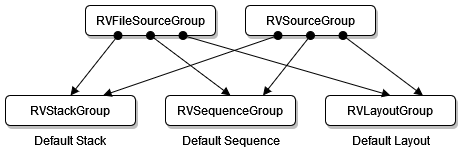
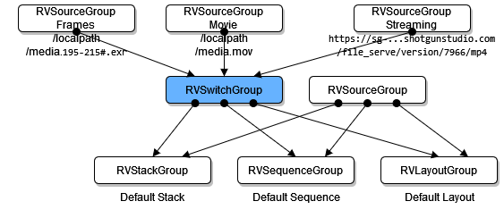

# OTIO Reader Package Overview

The RV package plugin is based on the [OTIO](http://opentimeline.io/) project.

The OTIO Reader is an RV package that allows RV to import and export OTIO files. The package is installed and loaded by default with support for all OTIO schemas part of OTIO version 0.15. So users can now import and export OTIO files through any one of the various RV import/export paths.

The rest of this section will detail how to customize the import and export processes, and how to support custom OTIO schemas or metadata.

## Imported and exported nodes

When importing, the resulting RV node graph will be added to the current view node. When exporting, the current view node will be the root of the exported OTIO. Since not all RV nodes are supported as the root of an OTIO file, the export option is only available when the view node is an RVSequenceGroup, RVStackGroup, or RVSourceGroup.

## Package contents

The RV package is installed in the usual Python package installation location: `<Installation directory>/Plugins/Python`.

The package also uses a number of files located in `Plugins/SupportFiles/otio_reader` and detailed below.

- `manifest.json`: Provides examples of schemas and hooks used in the import process.
- `annotation_hook.py`: An example of a hook called before importing an annotation.
- `annotation_schema.py` An example schema of an annotation.
- `cdlExportHook.py`: An example of exporting an RVLinearize to a custom CDL effect in OTIO.
- `cdlHook.py`: An example of importing a custom CDL effect in OTIO into an RVLinearize node.
- `cdlSchema.py` An example schema of a CDL effect.
- `clipHook.py`: An example of a hook called before importing a clip.
- `customTransitionHook.py`: An example of importing a custom transition in OTIO into RV.
- `effectHook.py`: A helper file for adding and setting RV properties from OTIO.
- `paint_schema.py`: An example schema for a paint annotation.
- `point_schema.py`: An example schema for a paint annotation point.
- `sourcePostExportHook.py`: A hook called after an RVSourceNodeGroup has been exported to a `Clip`. This can be used to add custom effects for other nodes within the same source group. The RVLinearize node is provided as an example.
- `retimeExportHook.py`: A hook for exporting an RVRetime node to OTIO schemas LinearTimeWarp or FreezeFrame.
- `timeWarpHook.py`: A hook for importing OTIO's LinearTimeWarp and FreezeFrame schemas.

## Using the OTIO hook system

The RV package is using the existing OTIO hook system to execute its hooks, so any existing `manifest.json` in the `OTIO_PLUGIN_MANIFEST_PATH` environment variable can be modified to work with RV's hook system, including RV's own `manifest.json` file.

The `OTIO_PLUGIN_MANIFEST_PATH` environment variable can be modified to work with RV's hook system, including RV's own manifest.json.

There are three types of OTIO hooks that will be called by the RV package:

- pre- and post-hooks for both import and export
- custom schema hooks for import
- custom transition hook for import
- custom RV node hooks for export

### Pre and post-hooks

The pre- and post-hooks are called before each known OTIO schema during import or RV node during export. For import, they are named `pre_hook_[schema_name]` and `post_hook_[schema_name]` and will be called just before and just after processing the schema. For export, they are similarly named `pre_export_hook_[node_name]` and `post_export_hook_[node_name]`. For example, a hook can be added named `pre_hook_Clip` and it will be called just before the import process has created an RV source based on the Clip. These hooks are useful for handling custom metadata in schemas. The provided `clipHook.py` is an example of this.

### Custom schema hooks

During import, the custom schema hooks are called whenever the `otio_reader` encounters a schema it cannot handle. These hooks are named `[schema_name]_to_rv`. For example, `CDL_to_rv` will be called whenever a schema named CDL is found. The provided `cdlHook.py` is an example of this. This is most commonly used for custom effects and other schemas that are not provided by OTIO.

The custom transition hook is similar to the custom schema hooks, except instead of being based on the schema name, it is called whenever the `transition_type` field of the Transition schema is set to Custom. The `customTransitionHook.py` is an example of this.

### Custom transition hook

The custom transition hook is similar to the custom schema hooks, except instead of being based on the schema name, it is called whenever the `transition_type` field of the Transition schema is set to Custom. The `customTransitionHook.py` is an example of this.

### Custom Open RV node hooks

During export, the custom RV node hooks are called whenever the `otio_reader` encounters a node it cannot handle.  These hooks are named `export_[node_name]`. The provided `cdlExportHook.py` is an example of this. This is commonly used for effects in RV that do not have equivalent OTIO schemas.

### Import Hook file parameters

The `in_timeline` parameter in the OTIO hook functions will be set to the OTIO schema being processed, not the full timeline. For example, in `cdlHook.py` the `in_timeline` is the CDL effect and in the `pre_hook_Clip` it is the Clip.

The `argument_map` will contain the context that can be helpful when creating RV nodes. For example, the following keys can currently be present, depending on which hook is being called:

- `transition`: `RV transition` output node
- `stack`: `RVStackGroup` output node
- `sequence`: RVSequenceGroup output node
- `source`: `RVSource` output node
- `source_group`: `RVSourceGroup` output node
- `track_kind`: `OTIO track_kind` property of the OTIO Track currently being processed

The `in_timeline parameter` in the OTIO hook functions will be set to the OTIO schema being processed—not the full timeline. For example, in `cdlHook.py` the `in_timeline` is the CDL effect and in the `pre_hook_Clip` it is the Clip.

The `argument_map` will contain the context that can be helpful when creating RV nodes. For example, the following keys can currently be present, depending on which hook is being called:

- `transition`: `RV transition` output node
- `stack`: `RVStackGroup` output node
- `sequence`: `RVSequenceGroup` output node
- `source`: `RVSource` output node
- `source_group`: `RVSourceGroup` output node
- `track_kind`: `OTIO track_kind` property of the OTIO Track currently being processed
- `global_start_time`: The `global_start_time` of the OTIO Timeline.

### Import Hook file return values

When RV nodes are being created—such as effects or transitions—the return value should be set to the name of the created node. The `otio_reader` will add the node as input at the current location in RV's node graph. It will also have its metadata added as a new property on the node named `otio.metadata`.

For pre- and post- hooks, no return value is expected.  However, the pre-hooks can optionally return False, which will quit processing the current schema and all its children.

### Export Hook file parameters

The `in_timeline` parameter in the OTIO hook functions will be set to the OTIO timeline that has been constructed up to that point. The `argument_map` will contain an `rv_node_name` key with its value set to the name of the RV node being processed.

Depending on the context in which the hook is called, the `argument_map` parameter can make the following keys available:

- `in_frame`: The `edl.in` value for clips and gaps
- `out_frame`: The `edl.out` value for clips and gaps
- `cut_in_frame`: The `edl.frame` value for clips and gaps
- `pre_item`: The OTIO item before a transition
- `post_item`: The OTIO item after a transition


### Export Hook file return values

If an effect returned, the plugin will add it to the effect list of the OTIO Clip or Gap. The OTIO Clip or Gap is created from the RVSourceGroup to which the effect is attached.

For pre- and post- hooks, no return value is expected.  However, the pre-hook nodes can optionally return `False`, which will quit processing the current node and all of its inputs.


## Media Multi-Reference Support

If you're using OTIO version 0.15 or later, you have access to the Media Multi-Reference (MMR) feature. 

With MMR, known and supported in RV as [Multiple Media Representations](../rv-manuals/rv-media-multi-representation.md), a clip can reference high-resolution media and proxies. In RV, this allows the user to easily switch between the different representations of the same media.

To accommodate these workflows, a single media reference contained within a clip becomes a dictionary of media references. Below is what the difference looks like when serialized.

OTIO Representation without MMR

```json
"media_reference" : {
   "OTIO_SCHEMA": "ImageSequenceReference.1",
   "metadata": {},
   "name": "",
   "available_range": null,
   "available_image_bounds": null,
   "target_url_base": "/mnt/nvme/Projects/aProject/scene01",
   "name_prefix": "opening.",
   "name_suffix": ".exr",
   "start_frame": 1,
   "frame_step": 1,
   "rate": 1.0,
   "frame_zero_padding": 4,
   "missing_frame_policy": "error"
}
```

OTIO Representation with MMR

```json
"media_references": {
   "Frames": {
       "OTIO_SCHEMA": "ImageSequenceReference.1",
       "metadata": {},
       "name": "",
       "available_range": null,
       "available_image_bounds": null,
       "target_url_base": "/mnt/nvme/Projects/aProject/scene01",
       "name_prefix": "opening.",
       "name_suffix": ".exr",
       "start_frame": 1,
       "frame_step": 1,
       "rate": 1.0,
       "frame_zero_padding": 4,
       "missing_frame_policy": "error"
   },
   "Movie": {
       "OTIO_SCHEMA": "ExternalReference.1",
       "metadata": {},
       "name": "",
       "available_range": {
           "OTIO_SCHEMA": "TimeRange.1",
           "duration": {
               "OTIO_SCHEMA": "RationalTime.1",
               "rate": 24.0,
               "value": 1300.0
           },
           "start_time": {
               "OTIO_SCHEMA": "RationalTime.1",
               "rate": 24.0,
               "value": 1.0
           }
       },
       "available_image_bounds": null,
       "target_url": "/mnt/nvme/Projects/aProject/scene01/opening.mov"
   },
   "Streaming": {
       "OTIO_SCHEMA": "ExternalReference.1",
       "metadata": {},
       "name": "",
       "available_range": {
           "OTIO_SCHEMA": "TimeRange.1",
           "duration": {
               "OTIO_SCHEMA": "RationalTime.1",
               "rate": 24.0,
               "value": 1300.0
           },
           "start_time": {
               "OTIO_SCHEMA": "RationalTime.1",
               "rate": 24.0,
               "value": 1.0
           }
       },
       "available_image_bounds": {
           "OTIO_SCHEMA": "Box2d.1",
           "min": {
               "OTIO_SCHEMA": "V2d.1",
               "x": -1.1764705882352942,
               "y": -0.5
           },
           "max": {
               "OTIO_SCHEMA": "V2d.1",
               "x": 1.1764705882352942,
               "y": 0.5
           }
       },
       "target_url": "https://acme.shotguncloud.com/file_serve/version/23088/mp4"
   }
},
"active_media_reference_key": "Streaming"
```

RV Representation without MMR



RV Representation with MMR



When you import an OTIO file in RV, you always end up with an RV SwitchGroup where `active_media_reference` sets the active RVSourceGroup.

When you export from RV an OTIO file, every SwitchGroup node outputs as a Clip with its `active_media_reference_key` set to the currently active RVSourceGroup.
